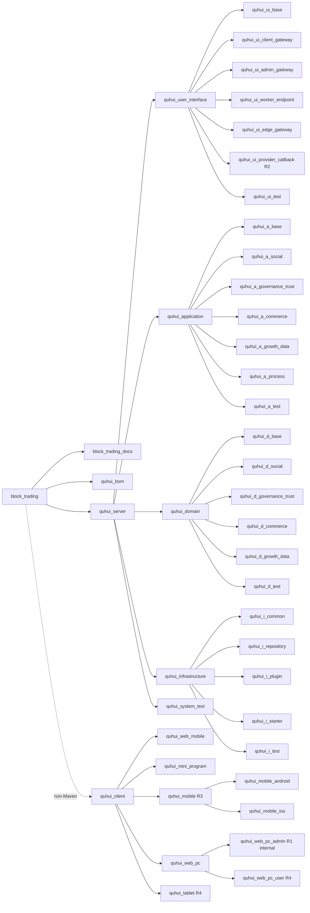

# 趣汇 DDD、六边形与 TDD 模块规划

## 1. 目标与约束

本文以[趣汇服务领域分析与边界定义](../趣汇服务领域边界设计/content.md)为业务边界，以[趣汇功能测试用例](../趣汇功能测试用例/content.md)为 Agent 编码的测试准入依据，定义 `block_trading` 根工程、`quhui_bom`、`quhui_server`、`quhui_client`、后端 DDD 层领域模块、API/Adapter/Boot/Test 边界和 TDD 测试结构。此前删除的是临时 `quhui` 代码目录与统一 Runtime 示例，不是 `quhui_*` 目标模块名称或模块边界；独立启动能力归属于具体业务模块内的可选 `*_boot`。

命名和依赖规则：

1. Maven 根父工程 artifactId 固定为 `block_trading`，目标根子模块固定为 `block_trading_docs`、`quhui_bom`、`quhui_server` 和 `quhui_client`；仅前三者属于 Maven Reactor，`quhui_client` 是独立 Node 工程根。
2. 所有 Maven artifactId 使用小写字母、数字和下划线；目标后端模块沿用 `quhui_*` 前缀。Java 包继续使用 `io.spray.qh`，不因 artifactId 使用下划线改变包命名。
3. 父模块只承担继承与聚合，不被业务代码依赖。业务源码跨模块只依赖目标模块的 `*_api`。
4. Adapter 提供本地、远程、消息和 Stub 实现；实际实现选择只发生在具体业务模块的 `*_boot` 或测试装配中，业务 Adapter 不互相依赖。
5. 四个 DDD 层均有测试父模块，测试父模块聚合本层领域测试模块；任何生产模块不得依赖 `*_test`。

## 2. 完整 Maven Reactor 与领域关系



本图是目标模块架构图，不表示当前所有模块都已创建。当前根 Maven 只聚合 `block_trading_docs`；后续将由根工程聚合 `quhui_bom` 与 `quhui_server`，`quhui_client` 作为同级独立 Node 工程存在且不进入 Maven Reactor。启动装配、部署交付和编译期依赖不增加第五个 Runtime 层。

### 2.1 逐级目录

```text
block_trading/
  block_trading_docs/
  quhui_bom/
  quhui_server/
    quhui_user_interface/
      quhui_ui_base/
      quhui_ui_client_gateway/
      quhui_ui_admin_gateway/
      quhui_ui_worker_endpoint/
      quhui_ui_edge_gateway/
      quhui_ui_provider_callback/             R2
      quhui_ui_test/
    quhui_application/
      quhui_a_base/
      quhui_a_social/
      quhui_a_governance_trust/
      quhui_a_commerce/                       R2
      quhui_a_growth_data/
      quhui_a_process/
      quhui_a_test/
    quhui_domain/
      quhui_d_base/
      quhui_d_social/
      quhui_d_governance_trust/
      quhui_d_commerce/                       R2
      quhui_d_growth_data/
      quhui_d_test/
    quhui_infrastructure/
      quhui_i_common/
      quhui_i_repository/
      quhui_i_plugin/
      quhui_i_starter/
      quhui_i_test/
    quhui_system_test/
  quhui_client/                               非 Maven Node 工程根
    quhui_web_mobile/                         R1
    quhui_mini_program/                       R1
    quhui_mobile/                             R3
      quhui_mobile_android/
      quhui_mobile_ios/
    quhui_web_pc/
      quhui_web_pc_admin/                     R1，仅内部运营管理
      quhui_web_pc_user/                      R4
    quhui_tablet/                             R4
```

- 当前根 `pom.xml` 只聚合 `block_trading_docs`；未来 `quhui_bom` 与 `quhui_server` 直接由 `block_trading` 聚合，后端层模块只能挂在 `quhui_server` 下。
- `quhui_bom` 只提供 Spring、Spring Cloud、MyBatis-Flex、测试与构建插件的版本/依赖管理，不承载生产业务代码或启动逻辑。
- `quhui_client` 是前端工程边界，不是 Maven 父模块；各终端应用使用自己的 `package.json`、构建工具和发布产物。
- 各分类父模块仅在有明确领域治理价值时存在；不创建“为了目录整齐”的空父模块。
- `quhui_*_test` 是层内测试父模块，不是生产能力；`quhui_system_test` 是 `quhui_server` 的跨层装配测试根，不是第五个 DDD 层。
- 未来的 `quhui_deployment` 只负责交付资产，不是 DDD 层、运行时服务或测试父模块；它消费具体 `*_boot` 和 `quhui_client` 前端工程的发布产物与版本化部署参数，不被领域业务代码依赖。

## 3. 领域模块与层关系

### 3.1 Interface：`quhui_user_interface`

| 领域模块 | 角色 | 首次周期 | 主要调用的应用 API | 测试模块 |
|---|---|---:|---|---|
| `quhui_ui_base_api` | 稳定请求上下文、错误、分页契约 | R1 | `quhui_i_common_api` | `quhui_ui_base_test` |
| `quhui_ui_client_gateway_api/adapter` | 用户端 BFF、HTTP DTO 与命令转换 | R1 | social、commerce、growth_data | `quhui_ui_client_gateway_test` |
| `quhui_ui_admin_gateway_api/adapter` | 三类管理员后台、MFA 入口与管理 DTO | R1 | governance_trust、moderation、region_policy | `quhui_ui_admin_gateway_test` |
| `quhui_ui_worker_endpoint_api/adapter` | Worker、MQ 消费、任务入站协议 | R1 | process、moderation、discovery、engagement | `quhui_ui_worker_endpoint_test` |
| `quhui_ui_edge_gateway_api/adapter` | 路由、认证前置、限流、灰度与上下文 | R1 | 受控 UI API | `quhui_ui_edge_gateway_test` |
| `quhui_ui_provider_callback_api/adapter` | 支付/物流回调签名和事件去重 | R2 | commerce、fulfillment | `quhui_ui_provider_callback_test` |

`quhui_ui_test` 聚合上表全部测试模块，验证协议、认证入口、DTO 映射、错误映射和入口幂等；UI Adapter 不可依赖 Application、Domain 或 Infrastructure 的具体 Adapter。

### 3.2 Application：`quhui_application`

| 分类父模块 | 领域模块 | 关键用例 | 首次周期 | 测试模块 |
|---|---|---|---:|---|
| `quhui_a_social` | `quhui_a_identity_api/adapter` | 身份、隐私、校园、关系 | R1 | `quhui_a_identity_test` |
| `quhui_a_social` | `quhui_a_community_api/adapter` | 发帖、参与、取消、内容控制 | R1 | `quhui_a_community_test` |
| `quhui_a_social` | `quhui_a_moderation_api/adapter` | 举报、审核链、申诉、控制回执 | R1 | `quhui_a_moderation_test` |
| `quhui_a_social` | `quhui_a_visibility_api/adapter` | 召回约束、读写裁决、失效 | R1 | `quhui_a_visibility_test` |
| `quhui_a_social` | `quhui_a_discovery_api/adapter` | 已授权搜索、信息流、反馈 | R1 | `quhui_a_discovery_test` |
| `quhui_a_social` | `quhui_a_engagement_api/adapter` | 通知、客服、关键送达 | R1 | `quhui_a_engagement_test` |
| `quhui_a_governance_trust` | `quhui_a_region_policy_api/adapter` | 区域、RBAC、策略、路由 | R1 | `quhui_a_region_policy_test` |
| `quhui_a_governance_trust` | `quhui_a_trust_safety_api/adapter` | 风险挑战、安全事件、账号处置 | R1/R4 | `quhui_a_trust_safety_test` |
| `quhui_a_governance_trust` | `quhui_a_governance_api/adapter` | 审批、审计、数据请求、法律保留 | R1/R3 | `quhui_a_governance_test` |
| `quhui_a_governance_trust` | `quhui_a_model_governance_api/adapter` | 模型版本准入与停用 | R1/R4 | `quhui_a_model_governance_test` |
| `quhui_a_commerce` | `quhui_a_commerce_api/adapter` | 可售、预占、订单、支付、退款、商品控制 | R2 | `quhui_a_commerce_test` |
| `quhui_a_commerce` | `quhui_a_fulfillment_api/adapter` | 物流、售后、履约状态报告 | R2 | `quhui_a_fulfillment_test` |
| `quhui_a_growth_data` | `quhui_a_growth_benefits_api/adapter` | 邀请、权益账本、配额 | R1 | `quhui_a_growth_benefits_test` |
| `quhui_a_growth_data` | `quhui_a_analytics_api/adapter` | 事件、实验、指标 | R1/R3 | `quhui_a_analytics_test` |
| `quhui_a_process` | `quhui_a_process_content_publication_api/adapter` | 审核控制与内容发布补偿 | R1 | `quhui_a_process_content_publication_test` |
| `quhui_a_process` | `quhui_a_process_group_buy_settlement_api/adapter` | 拼单资格、预占、支付、退款投影 | R2 | `quhui_a_process_group_buy_settlement_test` |
| `quhui_a_process` | `quhui_a_process_trade_fulfillment_api/adapter` | 支付后履约、退款补偿 | R2 | `quhui_a_process_trade_fulfillment_test` |
| `quhui_a_process` | `quhui_a_process_region_rollout_api/adapter` | 灰度、护栏、回滚 | R3 | `quhui_a_process_region_rollout_test` |
| `quhui_a_process` | `quhui_a_process_account_enforcement_api/adapter` | 封禁、豁免、申诉与解除 | R4 | `quhui_a_process_account_enforcement_test` |

`quhui_a_test` 聚合所有应用测试模块，测试用例以端口 Stub 驱动，验证事务意图、授权、幂等、补偿和事件输出；不启动完整 Spring Boot。

### 3.3 Domain：`quhui_domain`

| 分类父模块 | 领域模块 | 聚合/事实所有权 | 测试模块 |
|---|---|---|---|
| `quhui_d_social` | `quhui_d_identity_api/adapter` | 账户、认证、关系、年龄/监护 | `quhui_d_identity_test` |
| `quhui_d_social` | `quhui_d_community_api/adapter` | 帖子、参与、内容状态 | `quhui_d_community_test` |
| `quhui_d_social` | `quhui_d_visibility_api/adapter` | 可见性约束、裁决、失效 | `quhui_d_visibility_test` |
| `quhui_d_social` | `quhui_d_discovery_api/adapter` | 候选、排序、反馈读模型 | `quhui_d_discovery_test` |
| `quhui_d_social` | `quhui_d_engagement_api/adapter` | 通知、投递、客服 | `quhui_d_engagement_test` |
| `quhui_d_governance_trust` | `quhui_d_region_policy_api/adapter` | 区域、角色、策略、路由 | `quhui_d_region_policy_test` |
| `quhui_d_governance_trust` | `quhui_d_moderation_api/adapter` | 举报、审核案件、措施、申诉 | `quhui_d_moderation_test` |
| `quhui_d_governance_trust` | `quhui_d_trust_safety_api/adapter` | 挑战、风险、封禁、侵权 | `quhui_d_trust_safety_test` |
| `quhui_d_governance_trust` | `quhui_d_governance_api/adapter` | 数据资产、审计、审批、留存 | `quhui_d_governance_test` |
| `quhui_d_governance_trust` | `quhui_d_model_governance_api/adapter` | 模型目录、版本、准入 | `quhui_d_model_governance_test` |
| `quhui_d_commerce` | `quhui_d_commerce_api/adapter` | 商品、预占、订单、支付、拼单结算 | `quhui_d_commerce_test` |
| `quhui_d_commerce` | `quhui_d_fulfillment_api/adapter` | 配送、异常、售后、评价争议 | `quhui_d_fulfillment_test` |
| `quhui_d_growth_data` | `quhui_d_growth_benefits_api/adapter` | 邀请、权益账本、配额 | `quhui_d_growth_benefits_test` |
| `quhui_d_growth_data` | `quhui_d_analytics_api/adapter` | 事件、实验、指标 | `quhui_d_analytics_test` |

`quhui_d_test` 聚合所有领域测试模块。领域测试必须是最快的反馈层：不启 Spring、不连接 Oracle/MQ，覆盖聚合不变量、状态机、值对象、版本兼容和领域事件。

### 3.4 Infrastructure：`quhui_infrastructure`

| 领域模块 | 实现范围 | 测试模块 |
|---|---|---|
| `quhui_i_common_api` | 稳定错误、时间、上下文、加密引用 | `quhui_i_common_test` |
| `quhui_i_repository_oracle` | 各领域仓储、ContextSnapshot、Outbox/Inbox、显式 SQL | `quhui_i_repository_oracle_test` |
| `quhui_i_plugin_redis` | 缓存、限流、幂等、锁 | `quhui_i_plugin_redis_test` |
| `quhui_i_plugin_rabbitmq` | 领域事件、重试、死信、Inbox 去重 | `quhui_i_plugin_rabbitmq_test` |
| `quhui_i_plugin_minio` | 数据资产、签名访问、保留对象 | `quhui_i_plugin_minio_test` |
| `quhui_i_plugin_opensearch` | 搜索索引与受限召回约束 | `quhui_i_plugin_opensearch_test` |
| `quhui_i_plugin_embabel` | 模型调用、摘要、版本引用 | `quhui_i_plugin_embabel_test` |
| `quhui_i_plugin_payment` | 支付签名、回调、对账适配 | `quhui_i_plugin_payment_test` |
| `quhui_i_plugin_logistics` | 物流回调、节点去重、异常适配 | `quhui_i_plugin_logistics_test` |
| `quhui_i_starter_*` | Oracle、Redis、MQ、安全、观测自动配置 | `quhui_i_starter_test` |

`quhui_i_test` 聚合全部基础设施测试模块。该层允许 Testcontainers 或受控 Stub，验证真实 SQL、索引映射、序列化、签名、重试、死信、TTL 和外部错误映射。

测试父模块按发布周期增量聚合：当前周期只纳入已实施领域、既往回归模块和本期 System 场景。后续周期模块可预留 artifactId、版本化 API 契约和默认关闭的 Stub，但不得创建为当前 Reactor/CI 的必需模块，更不得要求当前周期连接尚未启用的供应商或运行时。

## 4. 前端工程边界

前端不进入 Maven Reactor，但必须进入项目模块架构，使用独立 Node 工程管理依赖、开发服务器、类型检查、Lint、构建和发布产物。当前只有原型工程，生产前端模块按实际启用周期创建。

| 前端模块 | 目标形态 | 当前状态 | 入口与职责 |
|---|---|---|---|
| `quhui_web_mobile` | 移动浏览器 Web | R1；原型阶段 | 对应 Vite 原型，完成五入口移动端交互 |
| `quhui_mini_program` | UniApp/小程序 | R1；未创建 | 优先适配分享、授权、参团与支付 |
| `quhui_web_pc_admin` | PC 内部运营管理 Web | R1；未创建 | 三类管理员后台；独立于用户端，调用后台 UserInterface API |
| `quhui_mobile` | 原生移动端根，按操作系统分发 | R3；未创建 | 管理 Android、iOS 的原生工程与终端发布 |
| `quhui_mobile_android` | Android 原生移动端 | R3；未创建 | 独立构建、签名、推送与系统能力适配 |
| `quhui_mobile_ios` | iOS 原生移动端 | R3；未创建 | 独立构建、签名、推送与系统能力适配 |
| `quhui_web_pc` | PC 端工程边界 | R1/R4；未创建 | 聚合内部运营后台与用户侧 PC 应用，不承载共享业务逻辑 |
| `quhui_web_pc_user` | 用户侧 PC 浏览器 Web | R4；未创建 | 面向信息密度更高的浏览、发布和管理操作 |
| `quhui_tablet` | 平板端 | R4；未创建 | 按平板交互与分屏能力独立适配 |

前端工程只能通过版本化 UserInterface API 访问后端；不得直接访问 Application、Domain、Repository 或 Infrastructure。当前 Vite 原型的应用入口是 `block_trading_docs/产品原型/shadcn-mobile/src/App.tsx`，它作为 Web 移动、小程序、Android 与 iOS 的统一移动交互参考；各生产工程在对应周期创建后再登记入口。

## 5. API、Adapter、Boot、Test 关系

每个可独立复用的领域能力按以下结构组织：

```text
quhui_<layer>_<capability>/                         聚合父 POM，不被生产代码依赖
  quhui_<layer>_<capability>_api/                   跨模块唯一编译期契约
  quhui_<layer>_<capability>_adapter/               实现聚合，不决定最终实现选择
    quhui_<layer>_<capability>_v1_service/          本地/进程内实现
    quhui_<layer>_<capability>_v1_remote/           可选：拆服务后的同步实现
    quhui_<layer>_<capability>_v1_mq/               可选：Outbox/Inbox 异步实现
    quhui_<layer>_<capability>_v1_stub/             可选：契约与故障替身
  quhui_<layer>_<capability>_test/                  单领域测试装配，可选
```

启动模块同样使用下划线：当前不建立统一 Runtime；只有出现明确业务入口、独立部署单元和测试需求时，才在所属 UserInterface、Application 或 Domain 业务模块内新增 `*_boot`。

### 5.1 Boot 与 Deployment 边界

`*_boot` 只负责所属业务单元的启动装配：选择领域 API 的 `v1_service`、`v1_remote`、`v1_mq` 或 `v1_stub` 实现，产出可执行 JAR、健康检查和运行所需的配置绑定。Boot 不承载领域规则，不成为跨领域业务逻辑的集中入口，也不保存 Dockerfile、Kubernetes 清单或环境密钥。

当前社区协作只规划四层生产模块和层测试父模块，最小跨层链路在 `quhui_system_test` 的测试装配中验证，不创建生产 Boot。该切片只覆盖提交审核、受控审核通过和状态查询，用于验证层间依赖方向和 TDD 测试；它不是完整 R1 社区服务，也未接入 Spring Boot、HTTP 路由、消息消费者、Oracle、Redis 或 MQ。未来需要独立部署时，应在具体业务模块内部新增 `*_boot`，而不是恢复统一 Runtime。

当前根工程可用 `mvn -q -pl block_trading_docs verify` 验证文档模块；`quhui_system_test` 尚未创建，不能宣称当前已具备跨层测试。需要可执行服务时，先在对应业务模块内创建并测试 `*_boot`，再由部署资产消费其 JAR。

`quhui_deployment` 只负责交付和运维资产：每个已建立的 `quhui_deploy_<unit>` 消费对应 `*_boot` JAR，维护镜像构建配置、`k8s/base`、各环境 overlay、资源/探针/网络策略、密钥引用、迁移执行顺序、灰度发布、回滚和运维脚本。部署模块不得编写领域逻辑、不得选择业务 Adapter 实现、不得保存明文密钥；当前未建立部署资产聚合模块。

| 部署模块 | 发布产物 | 首次周期 | 管理范围 |
|---|---|---:|---|
| `quhui_deploy_base` | 共享部署规范 | R1 | 镜像标签、通用标签、资源基线、探针约定、环境参数 Schema、脚本公共校验 |
| 后续新增的 `quhui_deploy_<unit>` | 对应业务模块的 `*_boot` JAR | 待定 | 仅在业务入口、运行边界和测试准入明确后建立 |
| `quhui_deploy_commerce`、`quhui_deploy_fulfillment` | 对应业务 `*_boot` JAR | R2 | 支付/履约独立部署后的隔离、扩缩、发布与回滚 |
| `quhui_deploy_analytics`、`quhui_deploy_discovery` | 对应业务 `*_boot` JAR | R3 | 分析与读模型任务的独立资源池、灰度与重建作业 |
| `quhui_deploy_trust_safety` | 对应领域 `*_boot` JAR | R4 | 风控隔离、模型凭据引用、案件服务发布与回滚 |

部署资产建议统一为下列目录，不将环境特定值写入 `*_boot` 或领域模块：

```text
quhui_deploy_<unit>/
  pom.xml                         Maven 聚合与镜像构建入口
  Dockerfile                      仅复制对应 `*_boot` JAR
  k8s/base/                       无环境特定值的工作负载、Service、策略与探针
  k8s/overlays/<environment>/     开发、测试、预发布、生产的受控差异
  scripts/                        部署前校验、迁移、灰度、回滚与失败收口脚本
```

依赖方向：外部请求 `-> UserInterface Adapter -> Application API -> Domain API`；Infrastructure 实现 Domain 输出端口；具体业务 `*_boot` 选择 `v1_service`、`v1_remote`、`v1_mq` 或 `v1_stub`；不同领域之间通过版本化 API 或 Outbox/Inbox 事件协作；Deployment 仅消费 `*_boot` 发布产物。测试模块可依赖被测模块 API/Adapter 与测试基础设施，生产模块绝不可反向依赖 Test。

## 6. TDD 执行与测试父模块

### 6.1 TDD 强制流程

每次 Agent 修改任何业务行为，必须按“Red -> Green -> Refactor”执行：

1. 先在所属 `*_test` 中新增或更新可失败的最小测试，用例 ID 引用[功能测试用例文档](../趣汇功能测试用例/content.md)。
2. 只实现通过该测试所需的最小生产代码；不得先写大量未被测试覆盖的分支。
3. 执行本领域测试、所属层测试父模块和受影响的跨领域/System 测试；失败不得进入下一实现步骤。
4. 通过后才重构，并重新执行同一测试集合。修改 API、事件 Schema、权限、状态机、补偿或数据迁移时，必须补充回归用例。

### 6.2 测试父模块职责

| 测试父模块 | 聚合范围 | 必须执行的测试 |
|---|---|---|
| `quhui_ui_test` | 所有 UI 领域测试 | HTTP/回调协议、认证入口、参数校验、DTO 映射、错误映射、入口幂等 |
| `quhui_a_test` | 所有 Application 领域和 Process 测试 | 用例编排、权限、事务意图、幂等、Outbox 意图、补偿与回执 |
| `quhui_d_test` | 所有 Domain 领域测试 | 聚合不变量、状态机、值对象、领域事件、版本/快照规则 |
| `quhui_i_test` | 所有 Infrastructure 测试 | Oracle/索引/消息/缓存/对象/模型/供应商适配与异常映射 |
| `quhui_system_test` | 关键跨层、跨领域、启动装配测试 | 权限穿透、审核链、交易履约、拼单补偿、封禁豁免、灾备/重放冒烟 |

### 6.3 构建门禁

1. 已实施领域的测试和架构测试必须在每次提交执行；任何失败阻断合并。未启用的后续领域测试不进入当前周期 Reactor、层测试父模块或 CI。
2. 修改单一领域时，至少执行该领域的 Domain、Application、UI/Infrastructure（适用时）和关联 Process 测试。
3. 修改共享 API、事件 Schema、可见性、审核、支付、库存、封禁或数据治理时，必须执行对应 `quhui_system_test` 场景。
4. R1 使用 Stub 与 Testcontainers 组合；支付、物流、模型供应商禁止依赖生产凭据完成自动化测试。
5. Maven Enforcer 和 ArchUnit 同时检查：`*_api` 不依赖 `*_adapter`/`*_boot`；非 Boot 不依赖其他领域 Adapter；生产模块不依赖 `*_test`；UI 外部入口不绕过 UI Adapter。

## 7. R1-R4 测试模块引入

| 周期 | 必须进入层测试父模块的领域测试 | System 测试重点 |
|---|---|---|
| R1 | identity、region_policy、community、moderation、visibility、discovery、engagement、growth_benefits、trust_safety、governance、analytics、model_governance、content_publication_process | 三段审核控制回执/安全降级、校园/拉黑召回前过滤、区域管理员隔离、Outbox/Inbox 重试、风险挑战和权益账本 |
| R2 | commerce、fulfillment、group_buy_settlement_process、trade_fulfillment_process、provider_callback | 预占/释放、拼单交易唯一性和资格投影、支付/物流回调幂等、商品合规控制回执、履约状态回传、售后退款补偿 |
| R3 | region_rollout_process、analytics 完整实现、OpenAPI/CLI（启用时） | 灰度与回滚、实验实际曝光、指标重算、法律保留、数据请求与恢复演练 |
| R4 | account_enforcement_process、trust_safety 处置、model_governance 多场景、discovery 模型排序 | 封禁豁免、人工覆盖/关闭模型、关联风险、侵权反通知、模型版本可重放 |

## 8. 验收标准

1. 全部 Maven artifactId 均为下划线命名；根坐标为 `block_trading`，目标根子模块为 `block_trading_docs`、`quhui_bom`、`quhui_server`；`quhui_client` 是同级非 Maven 工程，不建立统一 Runtime。
2. Reactor 图和目录能定位 `quhui_server` 下的四层、层内分类、领域模块、测试父模块、系统测试根，以及 `quhui_client` 下 R1 的 Web 移动/小程序/PC 运营后台、R3 的 Android/iOS、R4 的用户 PC/平板边界。
3. 每个已实施领域至少有一个与层测试父模块关联的 `*_test` 模块和功能用例文档条目；后续领域在其启用周期补齐模块和用例。
4. 每次 Agent 迭代都能从功能用例 ID 定位到领域测试、应用测试、适配器测试和必要的 System 测试。
5. 任何违反依赖方向、测试失败、权限绕过、幂等失效或关键状态机回归的提交都被构建门禁阻断。
