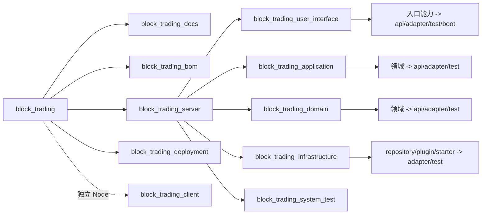
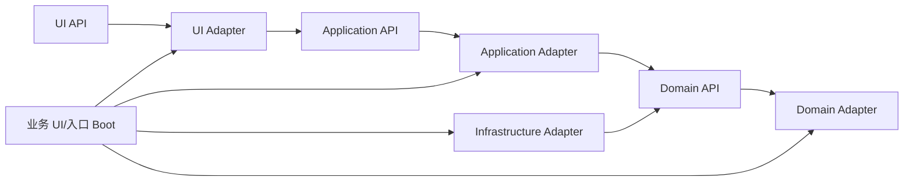

# 趣汇分层接口稳定、层内领域化的 DDD、六边形与 TDD 模块规划

## 1. 目标、依据与修正结论

本文以[趣汇服务领域分析与边界定义](../趣汇服务领域边界设计/content.md)为业务边界依据，以[趣汇系统架构设计](../趣汇系统架构设计/content.md)和[趣汇功能测试用例](../趣汇功能测试用例/content.md)为依赖、部署和测试准入依据，定义 Gradle 模块、API/Adapter/Boot/Test 和迁移边界。

当前 Gradle Build 的一级结构是正确且必须保留的：

```text
block_trading_server/
  block_trading_user_interface/
  block_trading_application/
  block_trading_domain/
  block_trading_infrastructure/
  block_trading_system_test/
```

问题不在四层结构，而在层内使用 `block_trading_d_r1_*`、`block_trading_a_r1_*`、`block_trading_i_r1_test` 和 `block_trading_ui_r1_test`，把多个限界上下文压入周期模块。后续不能复制 R2/R3 模块，也不能把四层反转为平层领域目录。

权威目标是：**`UserInterface/Application/Domain/Infrastructure` 保持为 `block_trading_server` 下的固定一级层；每层内部以限界上下文或稳定入口能力划分模块；模块继续使用 `api/adapter/service/test/boot` 接口形态；R1-R4 只作为交付元数据，不进入模块、包、类型或测试模块名称。**

本轮只修正规划，不移动生产源码。后续迁移必须逐层、逐领域执行，并保持现有 Boot 和接口兼容。

## 2. 模块维度及优先级

| 维度 | 作用 | 代码位置 | 是否稳定 |
|---|---|---|---|
| DDD 层 | 固定依赖方向和 API/Adapter 接口 | server 下四个一级层 | 稳定，不允许反转 |
| 限界上下文 | 确定事实写入权、业务语言和层内模块所有权 | Application/Domain/Infrastructure 层内 | 稳定 |
| 入站能力 | 定义 HTTP、回调、Worker、Gateway、WebSocket 等协议边界 | UserInterface 层内 | 稳定 |
| API/Adapter/Test/Boot | 分离公开契约、实现、验证和启动装配 | 各层业务模块内部 | 稳定 |
| 部署单元 | 组合多个层和领域形成可执行制品 | 所属 UserInterface/业务模块的 `*_boot` | 可演进但不按周期命名 |
| 迭代周期 | 描述首次启用、灰度和验收范围 | 文档、测试标签、feature flag、deployment manifest | 元数据，不是模块边界 |

限界上下文不能替代四层，四层也不能替代限界上下文。正确路径固定为：`server -> layer -> context/capability -> api/adapter/test/boot`。

## 3. 完整 Gradle Build 层级



根项目名固定为 `block_trading`。Gradle project 使用小写字母、数字和下划线，继续使用 `block_trading_ui_*`、`block_trading_a_*`、`block_trading_d_*`、`block_trading_i_*` 前缀。父项目只聚合任务和依赖门禁，不承载生产业务代码，也不被生产模块依赖。

## 4. UserInterface 层

UserInterface 按稳定入站能力组织，而不是按迭代或直接复制领域。现有 gateway、callback 和 realtime 层级接口继续保留：

```text
block_trading_user_interface/
  block_trading_ui_base/
    block_trading_ui_base_api/
    block_trading_ui_base_adapter/                 按需
    block_trading_ui_base_test/
  block_trading_ui_client_gateway/
    block_trading_ui_client_gateway_api/
    block_trading_ui_client_gateway_adapter/
    block_trading_ui_client_gateway_boot/
    block_trading_ui_client_gateway_test/
  block_trading_ui_admin_gateway/
    block_trading_ui_admin_gateway_api/
    block_trading_ui_admin_gateway_adapter/
    block_trading_ui_admin_gateway_boot/            独立部署时创建
    block_trading_ui_admin_gateway_test/
  block_trading_ui_worker_endpoint/
    block_trading_ui_worker_endpoint_api/
    block_trading_ui_worker_endpoint_adapter/
    block_trading_ui_worker_endpoint_boot/          独立部署时创建
    block_trading_ui_worker_endpoint_test/
  block_trading_ui_edge_gateway/
  block_trading_ui_realtime_gateway/
  block_trading_ui_provider_callback/
  block_trading_ui_test/                            聚合本层测试
```

每个入口能力沿用相同结构：`*_api` 保存协议级稳定契约和 DTO，`*_adapter` 只负责协议、认证上下文、校验、错误映射及对 Application API 的调用，`*_test` 验证协议和门禁，`*_boot` 只做装配。外部 HTTP、WebSocket、RPC、文件、CLI 和第三方回调不得绕过 UserInterface Adapter。

UI Adapter 可以按路由聚合多个领域 Application API，但不能拥有领域规则、Repository 或跨领域事务。接口路径属于哪个 gateway，不改变业务事实属于哪个领域。

## 5. Application 层内领域模块

Application 保持一级层，在层内按 14 个限界上下文划分稳定模块：

```text
block_trading_application/
  block_trading_a_identity/
    block_trading_a_identity_api/
    block_trading_a_identity_adapter/
    block_trading_a_identity_test/
  block_trading_a_region_policy/
  block_trading_a_community/
  block_trading_a_moderation/
  block_trading_a_visibility/
  block_trading_a_discovery/
  block_trading_a_engagement/
  block_trading_a_commerce/
  block_trading_a_fulfillment/
  block_trading_a_growth_benefits/
  block_trading_a_analytics/
  block_trading_a_model_governance/
  block_trading_a_trust_safety/
  block_trading_a_governance/
  block_trading_a_process/
  block_trading_a_test/                            聚合本层测试
```

`*_api` 是跨层、跨领域唯一允许依赖的 Application 契约，包含命令、查询、结果、错误、版本和用例接口；`*_adapter` 实现用例编排、事务意图、鉴权、幂等、补偿和输出端口调用；`*_test` 使用 Domain/Infrastructure 端口 Stub 验证应用行为，不启动完整 Boot。

`block_trading_a_process` 只承载确实跨越多个上下文且存在补偿状态的长流程，例如内容发布、拼单结算、交易履约和区域灰度；不得把普通跨域调用包装成统一流程层。

| Application 领域 | 主要用例 | 首次能力 |
|---|---|---:|
| identity | 登录、资料、校园认证、关系 | R1 |
| region_policy | 区域、RBAC、策略、路由 | R1 |
| community | 发帖、参与、评论、分享、内容控制 | R1 |
| moderation | 举报、审核、措施、申诉 | R1 |
| visibility | 召回约束、读写裁决和失效 | R1 |
| discovery | 搜索、信息流、反馈和混合检索 | R1；R3 增强 |
| engagement | 通知、会话、消息游标和客服 | R1 |
| commerce | 商品、购物车、订单、支付和库存 | R1 基础；R2 完整 |
| fulfillment | 物流、售后和履约状态 | R2 |
| growth_benefits | 邀请、会员、积分和配额 | R1 |
| analytics | 行为事件、指标和实验 | R1 采集；R3 完整 |
| model_governance | 模型版本、准入和停用 | R1 目录；R4 完整 |
| trust_safety | 风险挑战、安全事件和处置 | R1 风险；R4 处置 |
| governance | 审计、数据请求、留存和审批 | R1 基线；R3 完整 |

周期列只表示能力首次启用；R2 增强 commerce 时仍修改 `block_trading_a_commerce_*`，不能创建 `block_trading_a_r2_*`。

## 6. Domain 层内领域模块

Domain 同样保持一级层，并与 Application 的限界上下文一一对齐：

```text
block_trading_domain/
  block_trading_d_identity/
    block_trading_d_identity_api/
    block_trading_d_identity_adapter/
    block_trading_d_identity_test/
  block_trading_d_region_policy/
  block_trading_d_community/
  block_trading_d_moderation/
  block_trading_d_visibility/
  block_trading_d_discovery/
  block_trading_d_engagement/
  block_trading_d_commerce/
  block_trading_d_fulfillment/
  block_trading_d_growth_benefits/
  block_trading_d_analytics/
  block_trading_d_model_governance/
  block_trading_d_trust_safety/
  block_trading_d_governance/
  block_trading_d_test/                            聚合本层测试
```

`block_trading_d_<context>_api` 保存该领域的值对象、命令所需领域类型、Repository/领域服务端口和领域事件契约；`*_adapter` 保存聚合、状态机、策略和领域服务实现；`*_test` 覆盖不变量、状态迁移、版本兼容和事件，不启动 Spring 或连接外部设施。

其他领域不得依赖某领域的 `*_adapter`，跨领域同步协作优先依赖提供方 Application API；只有被明确批准的共享领域值类型才能依赖 Domain API。不得建立 `block_trading_d_r2_*` 或把 R1 模型继续追加进单一 `R1Models`。

## 7. Infrastructure 层与领域边界

Infrastructure 一级层继续保留 repository、plugin、starter 和 test 分类接口，但业务适配器必须能映射到唯一领域：

```text
block_trading_infrastructure/
  block_trading_i_common/
    block_trading_i_common_api/
    block_trading_i_common_adapter/
    block_trading_i_common_test/
  block_trading_i_repository/
    block_trading_i_repository_identity_oracle_adapter/
    block_trading_i_repository_community_oracle_adapter/
    block_trading_i_repository_moderation_oracle_adapter/
    block_trading_i_repository_engagement_oracle_adapter/
    block_trading_i_repository_commerce_oracle_adapter/
    block_trading_i_repository_governance_oracle_adapter/
    block_trading_i_repository_<context>_oracle_test/
  block_trading_i_plugin/
    block_trading_i_plugin_redis_adapter/
    block_trading_i_plugin_rabbitmq_adapter/
    block_trading_i_plugin_minio_adapter/
    block_trading_i_plugin_opensearch_adapter/
    block_trading_i_plugin_payment_adapter/
    block_trading_i_plugin_embedding_adapter/
    block_trading_i_plugin_<technology>_test/
  block_trading_i_starter/
    block_trading_i_starter_oracle/
    block_trading_i_starter_messaging/
    block_trading_i_starter_observability/
    block_trading_i_starter_test/
  block_trading_i_test/                             聚合本层测试
```

通用插件只提供技术客户端、序列化、连接、重试和错误映射，不拥有业务状态。业务 SQL、Jimmer Entity、MyBatis-Flex Mapper、OpenSearch Mapping、索引投影和消费者处理逻辑必须在模块名、包名和测试中声明所属领域；当前单一 `block_trading_i_repository_oracle` 需要按领域 Adapter 渐进拆分，但仍位于 Infrastructure 层。

每个聚合只向 Application 暴露一个 Repository Port。Oracle Adapter 可以组合 Jimmer 与 MyBatis-Flex DAO，但必须使用同一 DataSource 和本地事务；每个业务字段、乐观锁、审计流水和 Outbox 有唯一写入 DAO。ORM Entity、Mapper、DAO 和生成类型不得越过 Infrastructure。

## 8. API、Adapter、Boot、Test 依赖关系



依赖约束：

1. `*_api` 不依赖同层 `*_adapter`、`*_test` 或 `*_boot`。
2. UI Adapter 只调用 Application API，不直接访问 Domain、Repository 或 Infrastructure。
3. Application Adapter 依赖本领域 Application API 和必要的 Domain API，不依赖 Infrastructure 实现。
4. Domain Adapter 只实现本领域 Domain API；不同领域 Adapter 禁止互相依赖。
5. Infrastructure Adapter 实现 Domain/Application 输出端口，不被 Domain/Application 反向依赖。
6. Boot 是唯一允许选择并组合 UI/Application/Domain/Infrastructure Adapter 的生产模块。
7. 每层 `*_test` 父模块只聚合测试任务，不承载测试业务逻辑；生产模块禁止依赖任何 Test。

API 的 `v1/v2` 表示契约兼容版本，不表示 R1/R2 产品周期。需要进程内、远程、消息或 Stub 实现时，继续在 Adapter 下使用 `v1_service`、`v1_remote`、`v1_mq`、`v1_stub`，实现选择只发生在 Boot 或测试装配中。

## 9. Boot 与 Deployment

Boot 继续位于所属 UserInterface 或明确业务入口模块内。现有 `block_trading_ui_client_gateway_boot` 名称稳定，可继续作为模块化单体的受控装配根；后续只有管理端、Worker、回调或实时 Gateway 达到独立部署条件时，才在对应 UI 模块新增 `*_boot`。

Boot 不使用 `r1_boot/r2_boot` 命名，只负责启动、依赖注入、Adapter 选择、配置绑定、健康检查和可执行制品，不承载领域规则。R1-R4 能力集通过配置、feature flag 和 deployment manifest 选择。

`block_trading_deployment` 只消费 Boot 与前端产物。部署模块按稳定单元命名，例如 `block_trading_deploy_client_gateway`、`block_trading_deploy_commerce`；部署资产不进入四个 DDD 层，也不被业务代码依赖。

## 10. 前端工程边界

前端继续按终端和独立发布边界组织，不进入 Gradle Build：

| 前端模块 | 形态 | 首次周期 | 职责 |
|---|---|---:|---|
| `block_trading_web_mobile` | Vite/React 移动 Web | R1 | 用户五入口与业务流程 |
| `block_trading_mini_program` | UniApp 小程序 | R1 | 小程序授权、分享、参团和支付适配 |
| `block_trading_web_pc_admin` | 内部运营 PC | R1 | 三类管理员工作台，只调用管理端 API |
| `block_trading_mobile_android` | Android 原生 | R3 | 独立构建、签名和系统能力适配 |
| `block_trading_mobile_ios` | iOS 原生 | R3 | 独立构建、签名和系统能力适配 |
| `block_trading_web_pc_user` | 用户侧 PC Web | R4 | 高信息密度浏览、发布和管理 |
| `block_trading_tablet` | 平板端 | R4 | 分屏和大屏交互适配 |

前端只能通过版本化 UserInterface API 访问后端，不直接依赖 Application、Domain、Repository 或 Infrastructure。

## 11. TDD 与测试父模块

四层测试父模块继续保留：

| 测试父模块 | 聚合范围 | 主要验证 |
|---|---|---|
| `block_trading_ui_test` | UI 各入口能力测试 | 协议、认证、DTO、错误和入口幂等 |
| `block_trading_a_test` | Application 各领域和 Process 测试 | 用例、权限、事务意图、幂等和补偿 |
| `block_trading_d_test` | Domain 各领域测试 | 聚合不变量、状态机、值对象和事件 |
| `block_trading_i_test` | Infrastructure Repository/Plugin/Starter 测试 | Oracle、缓存、消息、对象、索引和供应商适配 |
| `block_trading_system_test` | 跨层、跨领域和 Boot 装配 | 权限穿透、审核链、交易链、消息恢复和部署冒烟 |

周期可以出现在测试用例 ID 或 Tag 中，例如 `R1_COMMUNITY_004`，但不能作为测试 Gradle project。单领域修改至少执行该领域四层相关测试和受影响 System 用例；共享 API、事件、权限、支付、库存或迁移变化必须扩大回归范围。

架构门禁必须阻断：新增 `block_trading_*_r[0-9]+_*` project、API 依赖 Adapter、UI 绕过 Application、Domain/Application 依赖 ORM/MQ/Netty、非 Boot 选择具体 Adapter、跨领域 Infrastructure 依赖和生产代码依赖测试模块。

## 12. 迭代能力进入规则

R1-R4 只允许出现在：

- 产品与业务文档的首次周期和状态；
- 测试用例 ID、Tag 和验收矩阵；
- feature flag、灰度策略和 deployment manifest；
- 数据库迁移兼容说明、发布记录和运行证据。

例如 R3 为 discovery 增加向量混合检索时，修改 `block_trading_a_discovery_*`、`block_trading_d_discovery_*`、`block_trading_i_plugin_opensearch_adapter` 及其测试；不得创建 `block_trading_a_r3_*` 或 `block_trading_d_discovery_r3`。

## 13. 从当前周期模块迁移

迁移只替换层内周期模块，不改变四个一级层：

| 当前模块/类型 | 同层目标模块 | 迁移动作 |
|---|---|---|
| `block_trading_d_r1_api`、`R1Models`、`R1Ports` | `block_trading_d_<context>_api` | 按 14 个领域拆分类型、端口和事件 |
| `block_trading_d_r1_service` | `block_trading_d_<context>_adapter` | 按聚合所有权迁移策略和领域实现 |
| `block_trading_d_r1_test` | `block_trading_d_<context>_test` + `block_trading_d_test` | 保留用例 ID，改为领域测试聚合 |
| `block_trading_a_r1_api`、`R1UseCases` | `block_trading_a_<context>_api` | 拆分命令、查询、结果和公开用例接口 |
| `block_trading_a_r1_service` | `block_trading_a_<context>_adapter` | 拆分事务编排、鉴权、幂等和补偿 |
| `block_trading_a_r1_test` | `block_trading_a_<context>_test` + `block_trading_a_test` | 按领域聚合 Application 测试 |
| `block_trading_i_repository_oracle` | `block_trading_i_repository_<context>_oracle_adapter` | 保持 Infrastructure 层，按表和 Repository 写入权拆分 |
| `block_trading_i_r1_test` | Repository/Plugin/Starter 对应 test + `block_trading_i_test` | 按适配器责任拆分真实设施测试 |
| `block_trading_ui_r1_test` | 各 UI 能力 test + `block_trading_ui_test` | 按 gateway/callback/realtime 协议拆分 |
| `R1GatewayApplication` | 现有 `block_trading_ui_client_gateway_boot` 内稳定启动类 | 仅移除类/包周期名，不移动 Boot 层级 |

实施顺序：

1. `M0`：冻结新增 `*_rN_*` project、包和公共类型；增加命名与依赖架构测试。
2. `M1`：在 Domain/Application 两层先建立 identity、region_policy、visibility 的 API/Adapter/Test，并用兼容 Adapter 维持现有 UI/Boot。
3. `M2`：迁移 community、moderation、discovery、engagement；同步拆分对应 Infrastructure Repository 和测试。
4. `M3`：迁移 commerce、growth_benefits、governance、trust_safety、model_governance、analytics；fulfillment 首次实施直接使用目标层级。
5. `M4`：UI Adapter 切换到各领域 Application API，现有 client gateway Boot 完成装配切换后，删除无引用的四层 `r1` 模块和周期包。

迁移期间旧、新模块不得同时写同一业务事实。每个批次必须保持 `./gradlew check`、当前 Boot、Docker 部署和关键浏览器用例可回滚。

## 14. 验收标准

1. `block_trading_server` 继续只有 UserInterface、Application、Domain、Infrastructure 四个生产一级层和 System Test，不出现领域平铺根。
2. 所有新业务模块路径满足 `server -> layer -> context/capability -> api/adapter/test/boot`。
3. `settings.gradle.kts` 不再新增任何 `*_rN_*` 生产或测试 project，现有周期模块按 M1-M4 逐步归零。
4. 每个领域在 Application 与 Domain 层有明确 API、Adapter 和 Test；Infrastructure 适配器能定位唯一领域所有权。
5. UI gateway/callback/realtime 的 API、Adapter、Test、Boot 层级接口保留，外部入口只能调用 Application API。
6. 四层测试父模块和 `block_trading_system_test` 均保留且只承担各自测试聚合/验证职责。
7. Boot 仍位于所属业务 UI/入口模块，不建立统一 Runtime，不按周期复制 Boot。
8. 文档门禁、Gradle 项目图、依赖架构测试、根 `check`、真实适配器测试和关键浏览器用例共同通过后，才可标记周期模块迁移完成。
