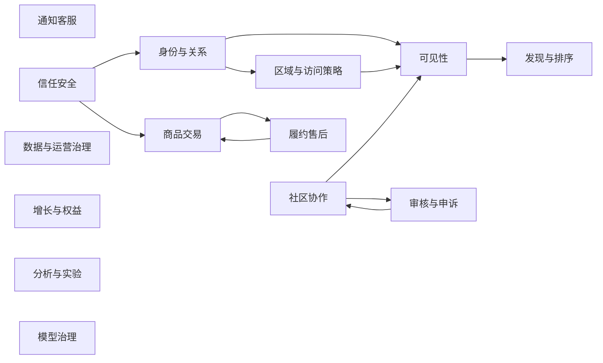

# 趣汇服务领域分析与边界定义

## 1. 目的与依据

本文先于代码模块规划定义趣汇的服务领域边界，作为后续 `*-api`、`*-adapter`、运行时装配和服务拆分的唯一业务依据。它不改变既定 R1-R4 范围，而是澄清每个业务事实由谁写入、何时需要同步确认、何时通过事件协作。

分析依据为[趣汇产品规划](../趣汇产品规划/content.md)、[趣汇核心实体设计](../../../数据库设计/趣汇核心实体设计.md)、[趣汇分期治理实体设计](../../../数据库设计/趣汇分期治理实体设计.md)和[趣汇系统架构设计](../趣汇系统架构设计/content.md)。

## 2. 领域识别方法

以如下四项共同判断服务领域，而非按页面、表数量或技术组件拆分：

1. **聚合不变量：** 必须在一个事务中保持的状态和规则，例如订单金额/支付状态、帖子参与人数、审核阶段顺序。
2. **事实写入权：** 只有一个领域可以创建或变更某类权威事实；其他领域只读取受控视图、快照或消费事件。
3. **生命周期与责任：** 事实的创建、变更、申诉、补偿、留存和人工责任是否由同一团队/队列承担。
4. **一致性需求：** 当前请求必须立即确认的动作使用同步用例 API；允许重试和最终一致的传播使用 Outbox 集成事件。

所有领域都必须保存业务发生时的 `region_id`、`campus_id`（适用时）、策略/模型版本、责任路由、`request_id` 和操作者。当前配置、搜索索引、缓存、推荐候选和指标都不能用于回推历史事实。

## 3. 领域全景与归属

| 领域 | 类型 | 首次落地 | 权威事实/主要实体 | 明确不负责 |
|---|---|---:|---|---|
| `identity` 身份与关系 | 支撑 | R1 | `qh_user`、身份、资料、偏好、设备、校园认证、年龄验证、监护同意、关注、拉黑、地址 | 内容状态、区域授权、封禁案件、订单/支付 |
| `region-policy` 区域与访问策略 | 支撑 | R1 | 区域树、业务开关、管理员角色/权限/数据范围、Casbin 执行投影、策略版本、服务路由、区域应急路由 | 用户资料、帖子可见结论、订单/物流主状态、审批流程记录 |
| `community` 社区协作 | 核心 | R1 | `qh_post` 聚合、类型扩展、媒体/位置、参与、留言、变更记录 | 举报案件裁决、索引、消息投递、账号处罚 |
| `moderation` 审核与申诉 | 核心 | R1 | 举报、审核案件、规则/模型/人工阶段、审核证据、审核申诉、商品合规 | 帖子/商品/账号最终业务状态、推荐排序 |
| `visibility` 可见性决策 | 核心支撑 | R1 | 可见性规则版本、读取/写入决策、失效任务与权限快照 | 拉黑/认证/帖子状态等原始事实，搜索索引、个性化排序 |
| `discovery` 发现与排序 | 核心 | R1 | 搜索文档、规则候选、排序策略、内容反馈、推荐候选 | 权限最终裁决、内容或商品主状态 |
| `engagement` 触达与客服 | 支撑 | R1 | 通知模板/业务通知、收件人、投递尝试、会话/成员/消息、确认游标、客服工单、SLA | 订单退款裁决、审核结论、聊天内容策略 |
| `commerce` 商品交易 | 核心 | R1 基础、R2 完整 | 商品/SKU、可售、价格、购物车、订单、支付；R2 增强库存预占、退款与对账 | 物流节点、履约工单、售后证据、营销实验 |
| `fulfillment` 履约售后 | 核心 | R2 | 配送、物流节点、异常、履约工单、售后请求/证据、评价争议 | 订单支付主状态、库存扣减、支付对账 |
| `growth-benefits` 增长与权益 | 支撑 | R1 | 邀请、兑换、会员当前投影、积分/权益账本、近邻配额 | 事件分析、实验曝光、在线鉴权、交易事实 |
| `analytics` 分析与实验 | 支撑 | R1 采集基线，R3 完整 | 事件字典、行为事件、指标、实验/分桶/实际曝光、区域健康度 | 权益账本、在线鉴权、交易/处罚事实 |
| `model-governance` 模型治理 | 支撑 | R1 审核模型目录，R4 完整 | 模型目录、版本、准入/停用、场景授权、凭据引用 | 业务决定、审核案件、风控案件、推荐候选 |
| `trust-safety` 信任安全 | 核心支撑 | R1 风险事实，R4 处置 | 风险挑战、安全事件、风险信号/关系、封禁案件/证据/申诉、侵权、业务模型决策记录 | 直接改用户、帖子、订单、支付事实；模型版本主数据 |
| `governance` 数据与运营治理 | 支撑 | R1 基线，R3 完整 | 数据资产、审计、政策同意、留存、法律保留、数据主体请求、审批工作流、应急操作记录 | 任意业务对象的主状态、业务管理员权限判定、区域策略版本 |

## 4. 边界定义

### 4.1 `identity` 身份与关系

- **聚合与写入权：** 账户是根聚合；身份绑定、资料、隐私偏好、登录设备、校园认证、年龄验证、监护同意、关注、拉黑和地址均由本领域写入。`qh_user_block` 是单向关系事实。
- **关键不变量：** 身份绑定不可重复；校园认证才可开启校园模式；年龄验证与监护同意决定受限能力但不等同于风控挑战；地址是履约输入而不是订单历史，订单必须保存自己的地址快照；拉黑关系变动必须可触发失效。
- **同步 API：** 登录主体解析、认证状态查询、校园范围查询、关系变更、拉黑关系判定。
- **发布事件：** `IdentityVerified`、`AgeVerificationChanged`、`GuardianConsentChanged`、`CampusScopeChanged`、`UserBlockChanged`、`PrivacyPreferenceChanged`、`AccountStatusChanged`。
- **边界约束：** 不拥有账号封禁案件；`trust-safety` 作出限制决定后，由本领域在认证/互动入口执行限制。账号注销请求由 `governance` 编排，本领域只处理可删除/匿名化的账户数据。

### 4.2 `region-policy` 区域与访问策略

- **聚合与写入权：** 区域、区域能力开关、管理员角色授予、角色权限、数据范围、Casbin 执行投影、业务策略版本、服务责任路由。
- **关键不变量：** `qh_admin_role_grant` 是授权事实，`qh_casbin_rule` 是可重建执行投影；投影版本落后、同步失败、角色到期或撤销后必须失败关闭。区域管理员只能在有效授权区域执行指定动作；高风险策略必须先获得 `governance` 审批，区域策略只在审批完成后产生可生效版本；区域关闭不应撤销已完成订单或用户的售后入口。
- **同步 API：** 区域准入、管理员能力清单、资源动作裁决、数据范围、策略有效版本、区域服务责任查询。
- **发布事件：** `RegionCapabilityChanged`、`PolicyPublished`、`AdminScopeChanged`、`ServiceRouteChanged`、`RegionalEmergencyRouteChanged`。
- **边界约束：** 它返回策略和作用域，不读取或写入帖子、订单、审核案件，也不保存审批流程记录。业务领域在自身事实中持久化所采用策略和路由快照。

### 4.3 `community` 社区协作

- **聚合与写入权：** `qh_post` 是统一聚合根；帖子类型扩展、媒体/地点、参与、留言、状态变更由本领域写入。
- **关键不变量：** 人数上下限、参与/退出/取消状态机、可编辑窗口、地点精度范围、帖子与参与支付状态分离；帖子状态变化保留流水。R2 拼单的 `payment_status` 仅是由交易事件驱动的参与资格投影，不能作为订单、支付或退款事实。
- **同步 API：** 创建草稿、提交发布、参与、退出、取消、读取已授权内容详情的业务视图。
- **发布事件：** `ContentSubmitted`、`PostParticipationChanged`、`PostQualified`、`PostStateChanged`、`PostStateControlApplied`、`ContentRemoved`。
- **边界约束：** 举报不属于社区事实，提交举报由 `moderation` 接收；审核结论或临时措施只作为幂等控制命令输入，社区自己改变帖子状态。群聊和通知均通过事件请求 `engagement`，不得同步写入其表。

### 4.4 `moderation` 审核与申诉

- **聚合与写入权：** `qh_report`、审核案件、三段审核阶段、证据、临时措施、审核申诉；商品合规是独立的合规案件，不与社区举报混用。
- **关键不变量：** 规则匹配 -> 大模型 -> 人工审核有可追溯阶段；高危命中只允许临时措施，最终处罚不能仅依赖模型；申诉与原案件、原版本、处理人独立留痕。
- **同步 API：** 提交举报、创建审核案件、查询对外审核状态、提交申诉；后台领取/裁决可经专用管理用例。高危规则/模型命中调用目标领域幂等 `applyModerationControl`，取得 `ModerationControlApplied` 或 `ModerationControlRejected` 回执。
- **发布事件：** `ReviewTemporaryMeasureRequested`、`ModerationControlApplied`、`ModerationControlRejected`、`ReviewConcluded`、`ReviewAppealResolved`、`ProductComplianceConcluded`。
- **边界约束：** 不直接更新 `qh_post`、商品或用户状态。结论必须携带目标、处置类型、原因分类、版本、证据引用和生效范围，由目标领域验证后执行并回执。新提交内容默认待审不可见；既有高危内容的控制投递失败时，目标领域必须按安全降级转为不可见/不可互动并进入人工加急，不能等待异步重试后继续公开。

### 4.5 `visibility` 可见性决策

- **聚合与写入权：** 可见性策略编译结果、访问决策、派生失效任务和权限相关快照；不是“永久允许名单”。
- **关键不变量：** 校园/区域/对象范围、双方拉黑、内容状态、封禁限制和读取目的必须在服务端每次读写/异步分发前重新评估；关系变化必须失效搜索、候选、缓存、未读摘要和待发推送。对搜索/推荐，先产生不可绕过的可见性查询约束，再执行召回/候选生成/排序；返回前仍逐项复核，防止索引延迟和边界变动。
- **同步 API：** `resolveVisibilityConstraints`、`canReadSubject`、`canWriteInteraction`、`filterVisibleSubjects`，入参包含主体、对象类型、动作、区域/校园上下文与请求目的。
- **发布事件：** `VisibilityInvalidationRequested`、`VisibilityPolicyChanged`；消费身份、关系、内容、区域、处置变更事件。
- **边界约束：** `identity` 持有拉黑/认证事实，`community` 持有内容状态，`trust-safety` 持有限制决定。`discovery` 必须用本领域的查询约束进行召回前过滤，并在返回前再调用本领域逐项复核；不可拿索引 ACL、缓存或候选名单代替该服务。

### 4.6 `discovery` 发现与排序

- **聚合与写入权：** 搜索文档、规则候选、排序策略、内容反馈、推荐候选和召回/排序版本；`qh_content_event` 的采集归 `analytics`，本领域只消费去敏事件或反馈视图。
- **关键不变量：** 索引和候选均为派生数据，可重建；调用 `visibility.resolveVisibilityConstraints` 后才能召回、候选生成和排序，返回前还须逐项复核；模型只产出候选或分数。
- **同步 API：** 传入可见性约束的内容/商品搜索、列表和排序查询；查询 API 与写入反馈 API 分离。
- **发布事件：** `SearchDocumentUpdated`、`CandidateInvalidated`、`RankingPolicyChanged`。
- **边界约束：** 不写帖子、商品、关系、实验或模型决策主事实；召回失败时宁可降级为受限列表，不能返回未经授权对象，也不能通过排序分数、总数或缓存侧信道暴露不可见对象。

### 4.7 `engagement` 触达与客服

- **聚合与写入权：** 业务通知、收件人、关键通知投递尝试、客服工单、SLA、升级、用户消息会话、成员、消息、消息序号、投递/确认/已读游标。聊天内容的审核请求通过 `moderation`，不在此领域裁决。
- **关键不变量：** 通知内容与收件人状态分离；关键通知保留每次渠道投递；每个会话的 `message_seq` 单调递增且 `client_message_id` 在发送方会话范围内幂等；`ACCEPTED` 仅代表消息持久化，不代表目标用户已看到；确认游标和已读游标只能前进。工单可关联订单、审核、履约和安全案件，但不替代它们的状态机。
- **同步 API：** 创建客服工单、查询自身通知/工单、确认关键通知；发送通知、创建/加入会话、`sendMessage`、`ackMessage`、`markRead` 和 `resumeMessages` 为版本化命令/查询接口。
- **发布事件：** `NotificationDeliveryChanged`、`ConversationMessageAccepted`、`ConversationMessageDelivered`、`ConversationReadCursorAdvanced`、`SupportTicketEscalated`、`SupportTicketResolved`。
- **边界约束：** Netty Gateway 只作为外部连接适配器，不拥有会话或消息事实；外部发送失败只改变本领域投递状态并触发重试，不能直接变更订单或审核结果。每次发送、投递、补拉和内容展示前调用 `visibility`，并执行 identity/trust-safety 的会话限制；连接断开或跨节点投递失败后通过 `message_seq` 和确认游标补拉，不能依赖节点内存恢复。

### 4.8 `commerce` 商品交易

- **聚合与写入权：** 商品/SKU、区域可售与价格、库存预占、购物车、订单、订单项快照、支付、退款、支付回调、对账。
- **关键不变量：** 订单金额基于价格/运费/优惠快照；库存预占必须幂等、可超时释放；支付回调先落原始事实再改变支付/订单；退款、订单、支付分别保留状态与流水。R2 拼单结算由本领域唯一拥有订单、预占、支付和退款，参与资格由 `PostQualified -> ReservationCreated -> PaymentSucceeded | SettlementFailed -> RefundCompleted` 的流程事件驱动。
- **同步 API：** 商品可售查询、库存预占/释放、创建订单、创建拼单结算、发起支付、查询订单/支付/拼单结算、发起退款、接收履约状态报告、执行商品 `applyModerationControl`。所有写命令携带 `request_id` 或 `idempotency_key`；商品合规控制执行后回传 `ModerationControlApplied/Rejected`。
- **发布事件：** `OrderCreated`、`ReservationCreated`、`InventoryReserved`、`PaymentSucceeded`、`SettlementFailed`、`RefundCompleted`、`FulfillmentStatusApplied`、`OrderCancelled`。
- **边界约束：** 物流节点、配送异常和售后证据不在本领域写入。履约域只能报告版本化履约状态，本领域更新自己的 `fulfillment_status` 投影并保留来源版本。封禁只限制不安全动作，账户被限制后仍允许查询订单、退款/售后和申诉。

### 4.9 `fulfillment` 履约售后

- **聚合与写入权：** 配送主单、物流节点、履约异常、履约工单、售后申请/证据、商品评价争议和物流订阅。
- **关键不变量：** 物流事件按供应商事件 ID 去重，不能回退已确认节点；异常和履约工单独立于通用客服工单；售后证据具有独立权限与留存。
- **同步 API：** 创建/查询售后、查询物流、提交证据、后台处理履约异常；物流供应商回调经过入站适配器再调用用例。
- **发布事件：** `FulfillmentStatusReported`、`DeliveryStatusChanged`、`DeliveryExceptionDetected`、`AfterSaleRequested`、`AfterSaleResolved`。
- **边界约束：** 不修改支付/订单主状态；需要退款时向 `commerce` 提交退款用例，保留订单 ID、责任路由和证据引用。订单详情的履约状态由本领域发布带来源版本的报告，`commerce` 幂等更新自身投影；评价的订单资格和争议流程属于本领域，评价文本违规审核则协作 `moderation`，反刷信号协作 `trust-safety`。

### 4.10 `growth-benefits` 增长与权益

- **聚合与写入权：** 邀请、兑换、会员当前投影、积分/权益不可变账本、近邻互助配额。
- **关键不变量：** 权益流水可冲正但不可覆盖；会员投影只能由账本重建；邀请、兑换和配额均保存幂等与撤销依据。R1 已提供 VIP、积分、邀请和配额的最小事实能力，R3 才叠加区域化权益策略。
- **同步 API：** 查询权益、兑换、扣减/恢复配额、申请邀请奖励。
- **发布事件：** `BenefitLedgerChanged`、`MembershipChanged`、`QuotaChanged`、`InvitationRewarded`。
- **边界约束：** 不承担行为分析、实验、在线授权、定价或订单支付；权益策略版本由 region-policy/growth 自身事实保存，模型仅能给出建议。

### 4.11 `analytics` 分析与实验

- **聚合与写入权：** 事件字典、行为事件、指标、实验/分桶/实际曝光、区域健康度。
- **关键不变量：** 实验分桶不等于实际曝光；指标只从领域事件和受控数据资产生成；R1/R2 先保留重放所需事件与上下文，R3 再引入区域运营与实验完整能力。
- **同步 API：** 实验分桶与护栏判断；普通指标查询仅提供去敏聚合结果。
- **发布事件：** `ExperimentAssigned`、`ExperimentExposed`、`RegionHealthComputed`。
- **边界约束：** 不作为权益、权限、价格、封禁或订单真实来源；推荐模型的离线训练数据必须经 `governance` 授权和留存控制。

### 4.12 `model-governance` 模型治理

- **聚合与写入权：** `qh_model_version` 的模型目录、场景授权、版本准入、停用、评测结果、凭据引用和可用状态。
- **关键不变量：** 业务场景只能调用已获准入且未停用的模型版本；模型版本变更不覆盖既有审核、推荐或风控决策记录；密钥值由基础设施管理，本领域只保存受控引用。
- **同步 API：** 校验场景可用模型、查询模型版本/能力、停用模型版本。
- **发布事件：** `ModelVersionApproved`、`ModelVersionDisabled`、`ModelPolicyChanged`。
- **边界约束：** moderation、discovery、trust-safety 只保存其模型调用的输入摘要、决定、原因和人工覆盖；不得修改模型版本主数据。

### 4.13 `trust-safety` 信任安全

- **聚合与写入权：** 风险挑战、安全事件、风险信号、关联关系、封禁案件及证据/事件/申诉、侵权投诉/反通知、业务模型决策记录。
- **关键不变量：** 单一风险信号不能永久封禁；永久封禁必须人工审批且申诉由非原决定人复核；限制作用域不得包含订单、退款/售后、申诉、隐私和注销。
- **同步 API：** 创建/验证风险挑战、记录安全事件、高风险动作限制判断、案件创建、申诉查询与提交、后台审批/解除。
- **发布事件：** `EnforcementDecisionIssued`、`EnforcementLifted`、`RiskSignalRaised`、`IpDecisionIssued`、`ModelDecisionRecorded`。
- **边界约束：** 不直接更新用户、帖子、订单、支付表；`identity`、`community`、`commerce` 分别在自身入口执行已审批的限制/处置，并返回执行结果供案件闭环。

### 4.14 `governance` 数据与运营治理

- **聚合与写入权：** 数据资产、审计记录、政策版本/同意、留存策略、法律保留、数据主体请求、通用审批流程与紧急操作记录。
- **关键不变量：** 历史同意、审计、留存与法律保留只追加或版本化；删除/导出先核验主体、留存与有效法律保留；审批只记录申请、审批和结果，策略/商品/封禁等目标事实仍由各自领域写入。
- **同步 API：** 数据访问用途校验、法律保留查询、数据请求提交/状态查询、审批状态查询、审计查询、政策确认。
- **发布事件：** `ApprovalGranted`、`ApprovalRejected`、`LegalHoldChanged`、`RetentionPolicyChanged`、`DataRequestCompleted`、`EmergencyActionRecorded`。
- **边界约束：** 不自行删除订单、帖子或审核证据；向对应领域发出经授权的数据处理命令并记录处理证据。上下文快照与 Outbox 不属于本领域表：每个业务领域在自己的事务和逻辑 schema 中写入 `ContextSnapshot`、Outbox 和 Inbox，governance 只消费其审计/留存索引。

## 5. 跨域协作与一致性矩阵

| 业务动作 | 发起领域 | 同步依赖 | 权威写入 | 异步后续 |
|---|---|---|---|---|
| 提交帖子 | community | identity、region-policy、visibility | 帖子/本域 ContextSnapshot/Outbox | moderation 创建案件；新内容默认待审不可见；控制生效后 discovery 索引、engagement 通知 |
| 审核临时措施/裁决 | moderation | 目标领域幂等 `applyModerationControl` | 审核案件/阶段/措施 | community 或 commerce 执行目标状态变更并回传 `ModerationControlApplied/Rejected`；失败按安全降级 |
| 拉黑用户 | identity | 无 | 关系事实 | visibility 失效；discovery/engagement 清理候选和待发内容 |
| 内容搜索/推荐 | discovery | visibility 的召回前查询约束及返回前复核 | 派生查询记录/反馈 | analytics 接收去敏行为事件 |
| 拼单结算 | commerce 流程 | community 资格、region-policy、库存预占、trust-safety 动作限制 | 订单/预占/支付/退款/Outbox | `PostQualified -> ReservationCreated -> PaymentSucceeded | SettlementFailed -> RefundCompleted` 驱动 community 参与资格投影 |
| 下单支付 | commerce | identity、region-policy、库存预占、trust-safety 动作限制 | 订单/支付/库存/本域 ContextSnapshot/Outbox | fulfillment 创建履约；engagement 关键通知；analytics 统计 |
| 物流异常/售后 | fulfillment | commerce 订单视图、region-policy 责任路由 | 物流/异常/售后/证据 | `FulfillmentStatusReported` 使 commerce 幂等更新订单履约投影；commerce 执行退款；engagement 通知；support 工单升级 |
| 会话发送/重连补拉 | engagement | identity、visibility、trust-safety 的当前限制；Netty Gateway 仅协议适配 | 会话、成员、消息、`message_seq`、投递/确认/已读游标、Outbox | Netty 节点根据 Redis 连接路由投递；离线、投递失败或发布摘流时客户端以 `RESUME` 补拉；moderation 审核消息内容 |
| 封禁处置 | trust-safety | identity/commerce 的受限能力视图 | 案件/证据/审批 | identity/community/commerce 执行各自限制；governance 法律保留 |
| 数据删除请求 | governance | identity 主体验证、法律保留判断 | 请求/审计 | 各事实领域执行本域匿名化/导出并回传证据 |

不得跨域共享数据库事务；需要可靠传播的动作按“本领域事实 + 本领域 ContextSnapshot/Outbox -> 版本化集成事件 -> 消费领域 Inbox 幂等处理”执行。`ContextSnapshot`、Outbox 和 Inbox 是每个领域的技术契约和本域持久化对象，不是可被其他领域直接写入的治理共享表。只有表中同一聚合不变量需要原子维护时，才允许在同一领域事务内处理。

## 6. 初步服务拆分判断

R1 将上述领域作为模块化单体中的业务边界和代码所有权，不等于立即部署为独立服务。R1 只建设已确认的 UserInterface 入口和领域/Application 模块；独立部署单元按需在所属业务模块内创建 `*_boot`。

| 优先独立部署候选 | 最早周期 | 触发条件 |
|---|---:|---|
| `commerce` | R2 | 支付回调、库存并发、资金职责或合规审计需要独立发布/隔离 |
| `fulfillment` | R2 | 物流供应商网络、履约 SLA 或售后队列需要独立容量/权限 |
| `analytics` | R3 | OLAP 写入和指标计算影响在线业务资源池 |
| `model-governance` | R4 | 模型目录、凭据和准入需与在线业务、供应商安全隔离 |
| `discovery` | R3/R4 | 索引/候选计算需要独立伸缩，且可见性 API 已稳定 |
| `trust-safety` | R4 | 风控图谱、模型凭据和案件审查要求安全隔离 |

无论是否拆服务，领域 API、业务 ID、事件 Schema、历史快照和审计查询语义保持兼容；通信方式由具体业务 `*_boot` 或 Adapter 选择，不由领域代码决定。

## 7. 领域边界验收

1. 任一业务表都能归属唯一服务领域，并能说明其他领域的读取方式。
2. 审核、风控、履约、治理只能产出自己拥有的事实和指令，不可直接覆盖内容、账户或订单主状态。
3. 搜索和推荐在召回前取得可见性查询约束、返回前逐项复核；缓存、消息和异步分发同样经过可见性决定，拉黑或范围变动可触发失效。
4. 审核高危控制具有目标域幂等执行回执和安全降级；未执行的临时措施不能使内容继续公开或互动。
5. 订单、支付、库存、物流、售后和退款具有独立状态/流水，且跨领域只通过 API 或事件协作；拼单资金事实唯一归 commerce，社区只保存资格投影。
6. 权益账本与分析实验由不同领域拥有；模型版本由 model-governance 唯一拥有；审批记录由 governance 唯一拥有。
7. R4 封禁不阻断订单、退款/售后、申诉、隐私和注销；模型结果可审计、人工覆盖和关闭。
8. R2-R4 的新领域不会要求回写覆盖 R1 既有事实，只以快照、事件和扩展实体衔接。

## 8. 独立审查结论

本边界已由独立审查任务从产品生命周期、实体归属、跨域一致性和后续拆服务角度复核，并完成以下调整：

1. 搜索/推荐改为“可见性约束先于召回，返回前逐项复核”，消除排序、计数和缓存侧信道。
2. 审核临时措施增加目标域幂等控制、执行回执和安全降级，避免高危内容在异步投递期间继续公开。
3. R2 拼单由 commerce 唯一拥有预占、订单、支付和退款；community 只维护交易事件驱动的参与资格投影。
4. 原分析增长领域拆为 R1 增长权益账本与 R1 采集/R3 完整启用的分析实验领域。
5. 每个领域在本地事务写 ContextSnapshot、Outbox 和 Inbox；模型版本、审批、风险挑战和安全事件的所有权已分别明确。

该结论已同步回检[趣汇系统架构设计](../趣汇系统架构设计/content.md)和[趣汇 DDD、六边形与模块 API 边界规划](../趣汇代码模块规划/content.md)。
