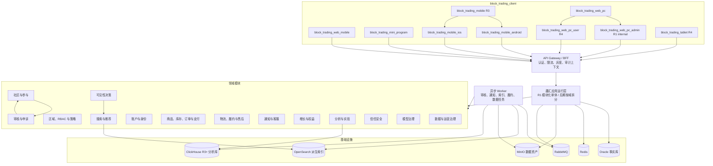
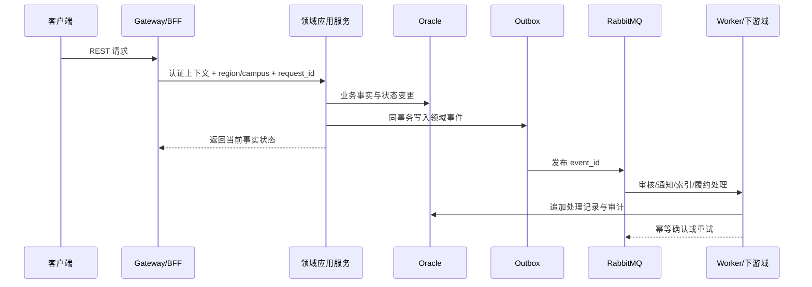

# 趣汇系统架构设计与技术选型

## 1. 设计范围

本文基于[趣汇产品规划](../趣汇产品规划/content.md)、[趣汇核心实体设计](../../../数据库设计/趣汇核心实体设计.md)和[趣汇分期治理实体设计](../../../数据库设计/趣汇分期治理实体设计.md)，定义 R1-R4 的系统架构、领域边界、数据与事件流、部署演进和技术选型。

本文解决“系统如何承载产品生命周期”的问题，不改变 R1-R4 的功能范围。R1 仅开放单区域白名单基础支付，不因架构设计提前开放规模化收款、自动退款、完整履约、账号封禁分级或个性化推荐；后期能力通过已定义的领域接口、事件和快照扩展。

## 2. 现状约束与架构目标

### 2.1 已确定的技术约束

| 类别 | 已确定技术 | 架构使用口径 |
|---|---|---|
| 后端 | Kotlin、Gradle Kotlin DSL、Spring Boot 4、Spring Cloud、Spring Embabel、Jimmer、MyBatis-Flex | Kotlin 是后端默认语言；Gradle 是后端唯一权威多项目构建；Jimmer 与 MyBatis-Flex 仅在 Infrastructure 组合；Spring Cloud 只承担服务治理能力，不替代领域边界；Embabel 作为模型/智能流程编排适配层 |
| 前端 | Vite、React、UniApp | Web、Mobile、Micro-app 共用 API 契约；运营后台与用户端前端独立构建 |
| 数据库 | Oracle | 交易、治理、权限、订单、审核和审计事实的权威存储；按领域逻辑分 schema/表前缀，不跨领域写表 |
| 配置与发现 | Nacos | 配置、服务发现和动态开关；高风险配置必须有版本、审批、生效时间和回滚记录 |
| 缓存与短状态 | Redis | 会话、限流、幂等键、分布式锁、缓存和派生状态；不保存唯一业务事实 |
| 消息 | RabbitMQ | 领域事件、Outbox 投递、异步审核、通知、库存/物流回调和重试；消费者必须幂等 |
| 实时连接 | Netty | WebSocket 长连接、心跳、连接级限流和协议编解码；连接层只作 UserInterface 协议适配，不保存领域事实 |
| 对象存储 | MinIO | 媒体、审核证据、售后材料和导出文件；通过数据资产实体、摘要、权限和签名 URL 管理 |

### 2.2 目标

1. R1 以受控内测为目标，优先保证审核、可见性、区域权限、客服、安全和回滚链路可观测。
2. R2 在单区域内提供支付、库存、订单、物流和售后闭环，资金与履约状态必须可补偿、可对账、可人工接管。
3. R3 支持多区域配置、灰度、指标、实验、数据请求和灾备，不因区域扩展改写早期历史归属。
4. R4 支持封禁分级、反欺诈、推荐/风控模型和商业化策略，自动决策必须可解释、可复核、可关闭。
5. 领域代码遵循 DDD，应用层遵循六边形架构；基础设施可替换，领域层不直接依赖 Oracle、Redis、RabbitMQ 或模型供应商。

## 3. 总体架构

### 3.0 系统入口与当前运行状态

| 入口类型 | 当前入口 | 当前状态 | 允许访问的边界 |
|---|---|---|---|
| Maven 构建入口 | 根目录 `pom.xml` | 当前只聚合 `block_trading_docs` | 文档构建与校验 |
| 后端目标根 | `block_trading_server` | 未创建，未来由根 Gradle Build 聚合 | 仅承载 `block_trading_user_interface`、`block_trading_application`、`block_trading_domain`、`block_trading_infrastructure` 与 `block_trading_system_test` |
| 前端目标根 | `block_trading_client` | 未创建，不进入 Gradle Build | R1 管理 Web 移动、小程序与 `block_trading_web_pc_admin`；R3 管理 Android/iOS；R4 管理 `block_trading_web_pc_user` 与平板终端工程 |
| 部署与运维目标根 | `block_trading_deployment` | 未创建，按实际部署单元增量建立 | 只消费后端 `*_boot` 与前端发布产物，管理部署清单、镜像、环境差异、数据库迁移、发布/回滚脚本和日志归档作业 |
| 前端原型入口 | `block_trading_docs/产品原型/shadcn-mobile/package.json` | 可执行 Vite 原型 | 作为 Web 移动、小程序、Android 与 iOS 的统一移动交互参考，不等同于生产工程 |
| 后端外部请求入口 | `block_trading_user_interface` Adapter | 后端模块尚未恢复 | HTTP、WebSocket、RPC、文件和第三方回调只能进入 UserInterface |
| 后端业务启动入口 | `block_trading_server` 内具体业务模块的 `*_boot` | 按独立部署需求创建 | 负责本业务单元装配，不建立统一 Runtime |

当前没有可执行后端服务入口。`block_trading_system_test` 只负责跨层验证，不能作为生产入口；前端原型也不代表已完成后端服务。`block_trading_bom` 是根级依赖/插件版本基线，不含业务代码和运行入口。



### 3.1 运行形态决策

- **R1：模块化单体 + 独立异步 Worker。** API、领域应用服务和仓储部署为一个或少量实例；审核模型调用、消息投递、索引同步、数据资产扫描和失效任务由 Worker 执行。这样保留领域隔离，同时降低内测期部署和排障成本。
- **R2：交易与履约具备独立部署选项。** 当支付回调、库存锁定、物流回传和客服 SLA 产生独立容量或责任边界时，将 `trade`、`fulfillment` 从模块化单体拆为服务；数据库访问和事件契约不改变。
- **R3：运营配置、通知、搜索/推荐读模型和分析任务独立扩展。** 多区域配置、实验分流、触达频控和指标计算具有不同伸缩周期，可独立部署；事实仍由领域服务写入，读模型异步构建。
- **R4：风控、推荐、模型网关和权益策略独立扩展。** 模型推理、关联图谱、封禁案件、侵权和复杂权益均不能直接写入核心交易表；通过决策 API、案件表和事件流接入。

### 3.2 请求与异步边界



同步请求只负责完成本领域必须立即确认的状态；跨域通知、搜索索引、模型审核、物流节点、指标计算和缓存失效走事件。任何消费者重复、乱序或延迟都不能覆盖已确认的事实状态。

### 3.3 实时通信与会话边界

Netty 作为 `block_trading_ui_realtime_gateway` 的唯一长连接框架，只承接 WebSocket 升级、TLS/协议编解码、令牌校验、设备会话绑定、心跳、单连接限流、连接登记、摘流通知和客户端重连指令。每个 Channel Pipeline 必须按“协议校验 -> 身份与设备绑定 -> 频控 -> 命令/确认分发 -> 心跳与异常关闭”分层；Netty Handler 不得直接调用 Mapper、DAO 或跨领域表。

连接建立、发送、确认、已读、拉黑/禁言/权限变更和重连恢复均转为版本化 Application API。`engagement` 持有会话、成员、消息、投递、已读游标和消息序号的领域事实，`moderation` 裁决消息内容，`identity` 与 `trust-safety` 决定账号/设备限制，`visibility` 在发送、投递和恢复前复核对话双方的可见性。Netty 节点只保存可丢失的 `connection_id -> node/channel` 短状态；跨节点在线投递通过 Redis 路由索引与 RabbitMQ 事件协作，离线、跨节点失败或重连场景一律以 Oracle 中按会话单调递增的 `message_seq` 和客户端确认游标补拉，不以 Channel 内存作为消息事实。

实时协议的命令类型为封闭枚举：`AUTH`（认证/续期）、`PING`（心跳）、`SEND`（提交待发送消息）、`ACK`（确认收到指定 `message_seq`）、`READ`（更新已读游标）、`RESUME`（按会话和游标补拉）、`DRAIN`（服务端要求客户端在抖动退避后重连）、`ERROR`（受控失败）。消息投递结果为封闭枚举：`ACCEPTED`（服务端已持久化）、`DELIVERED`（已写入目标连接）、`ACKED`（客户端已确认）、`OFFLINE`（等待补拉）、`REJECTED`（鉴权、频控、内容或会话限制拒绝）。`SEND` 必须携带 `client_message_id` 作为幂等键；`ACCEPTED` 不能承诺对端已展示，`ACKED` 不能替代已读事实。

## 4. 领域边界与模块职责

| 领域模块 | 核心职责 | 主要实体 | 首次发布 | 后续扩展 |
|---|---|---|---|---|
| 账户与身份 | 登录、身份绑定、资料、隐私、校园认证、年龄与监护、关系事实 | `qh_user`、`qh_user_identity`、`qh_user_preference`、`qh_student_verification`、`qh_user_block` | R1 | R4 处置执行、数据主体请求协作 |
| 区域、RBAC 与策略 | 区域树、准入、管理员角色/权限、区域服务路由、策略版本与应急路由 | `qh_region`、`qh_region_business_policy`、`qh_admin_*`、`qh_region_service_route` | R1 | R2 履约路由，R3 模板/灰度 |
| 社区与参与 | 帖子类型、参与、留言、活动状态和目标域内容控制 | `qh_post`、`qh_post_participant`、`qh_post_comment` | R1 | R2 拼单资格投影，R4 侵权/封禁处置执行 |
| 审核与申诉 | 举报、规则匹配、大模型审核、人工审核、临时措施、申诉、证据与商品合规 | `qh_report`、`qh_review_case`、`qh_review_stage`、`qh_review_evidence`、`qh_review_appeal` | R1 | R2 商品合规，R4 侵权协作 |
| 可见性决策 | 校园/区域/拉黑/状态过滤、召回前查询约束、返回前复核和失效 | `qh_visibility_*`、`qh_visibility_invalidation_task` | R1 | R3 多区域策略，R4 处置范围 |
| 搜索与推荐 | 派生索引、规则排序、推荐候选、内容反馈 | `qh_content_feedback`、搜索/候选读模型 | R1 | R3 实验接入，R4 个性化模型 |
| 交易 | 商品、SKU、区域可售、区域库存、库存预占、购物车、拼单结算、订单、支付与商品合规控制执行 | `qh_product*`、`qh_region_sku_*`、`qh_inventory_reservation`、`qh_group_buy_settlement`、`qh_order*`、`qh_payment*` | R2 | R3 多区域经营，R4 商业化策略 |
| 履约与售后 | 配送范围、运单、物流节点、异常、履约工单、售后、评价资格/争议 | `qh_order_delivery*`、`qh_delivery_exception`、`qh_fulfillment_work_order`、`qh_after_sale*`、`qh_product_review`、`qh_review_dispute` | R2 | R3 区域健康度，R4 风险关联 |
| 通知与客服 | 业务通知、站内/备用触达、客服工单、SLA、升级 | `qh_notification*`、`qh_notification_delivery`、`qh_support_ticket*` | R1 | R2 关键送达，R3 频控订阅 |
| 增长与权益 | 邀请、兑换、会员、积分/权益账本和近邻配额 | `qh_invitation`、`qh_redeem_*`、`qh_user_membership`、`qh_membership_ledger`、`qh_points_ledger` | R1 | R3 区域权益策略 |
| 分析与实验 | 事件采集、指标、实验、曝光和区域健康度 | `qh_content_event`、`qh_region_health_metric_daily`、`qh_operation_experiment`、`qh_experiment_*` | R1 采集基线 | R3 分析/实验完整能力 |
| 信任安全 | 风险挑战、安全事件、账号处置、关联图谱、侵权和业务模型决策记录 | `qh_risk_event`、`qh_account_enforcement_*`、`qh_risk_*`、`qh_model_decision`、`qh_ip_*` | R1 风险事实 | R4 处置与自动化 |
| 模型治理 | 模型目录、版本、准入/停用、场景授权和凭据引用 | `qh_model_version`、模型评测/授权实体 | R1 审核模型目录 | R4 多场景模型治理 |
| 数据与运营治理 | 数据资产、审计、政策同意、留存、法律保留、数据请求、审批与应急记录 | `qh_data_asset`、`qh_data_subject_request`、`qh_legal_hold`、`qh_policy_version`、审批/审计实体 | R1 基线 | R3 完整数据治理 |

### 4.1 领域依赖规则

1. 账户域提供身份和授权上下文，不直接调用商品、内容或通知表。
2. 区域/RBAC 域提供“能否访问/能否操作”的策略决策；业务域保存发生时的区域和策略快照。
3. 审核域只负责举报/案件/结论/临时措施；高危控制由目标域通过幂等控制 API 执行并回执。新内容默认待审不可见，控制失败按安全降级处理。
4. 可见性域生成召回前查询约束并在返回前逐项复核，不保存永久“允许访问名单”；搜索、推荐、缓存和异步分发均不能绕过它。
5. 交易域是订单、支付、库存和拼单资金事实的唯一写入方；履约域通过订单 ID 和版本化状态报告协作，不直接修改订单/支付事实。
6. 增长权益账本与分析实验分别拥有；模型治理域拥有模型版本，业务域只保存决策记录。
7. 风险域输出信号或已审批的处置建议；高风险处置必须经过策略校验、人工复核或审批，不能由模型直接永久封禁。
8. 审批流程、审计和法律保留归治理域；区域策略版本与生效/回滚归区域策略域。

## 5. 六边形架构与代码分层

每个领域模块采用同一层次，但不强制抽取跨域公共业务服务。目标 Gradle 多项目聚合、限界上下文、端口归属和分期装配详见[趣汇 DDD 与六边形代码模块规划](../趣汇代码模块规划/content.md)：

```text
<domain>/
  domain/
    model/              聚合、值对象、领域事件、状态机
    service/            领域规则与跨实体不变量
    repository/         仓储端口（接口）
  application/
    command/            写用例、幂等与权限前置
    query/              读用例、分页和脱敏
    facade/             对外用例接口
  adapter/
    in/web/              REST 控制器、请求校验、DTO
    in/message/          RabbitMQ 消费者、重试与死信
    out/persistence/     组合 Jimmer DAO / MyBatis-Flex Mapper 的 Repository 实现
    out/messaging/       Outbox 发布、事件序列化
    out/provider/        支付、物流、短信、模型等外部适配器
  infrastructure/
    config/              Nacos 配置映射与开关
    security/             Spring Security、MFA、鉴权上下文
```

约束：领域层不得依赖 Web、MyBatis-Flex、Redis、RabbitMQ 或具体模型供应商；应用层负责事务边界和幂等；适配器负责协议转换和外部失败映射；查询不得绕过领域权限服务直接暴露表数据。

## 6. 数据架构

### 6.1 权威数据与派生数据

| 数据类型 | 权威存储 | 说明 |
|---|---|---|
| 账户、区域、权限、审核、订单、支付、库存预占、售后、审计 | Oracle | 只由所属领域写入；状态变化追加流水；跨域只通过端口或事件访问 |
| 会话、限流、验证码、短期幂等、缓存、分布式锁 | Redis | 设定 TTL；丢失后可重建或重新挑战，不作为最终事实 |
| 媒体、审核证据、售后材料、导出包 | MinIO | `qh_data_asset` 管理摘要、数据分类、保留和权限；客户端使用短期签名 URL |
| 搜索/推荐索引 | OpenSearch | 由 Oracle 事实和事件异步构建；索引过滤是优化，服务端鉴权是最终边界 |
| 行为分析和区域指标 | R1/R2 Oracle 事件表，R3+ ClickHouse | R3 才引入 OLAP；原始事件保留摘要和上下文版本，不直接保存不可控画像 |

### 6.2 Oracle 组织策略

- R1 可使用同一 Oracle 集群，按领域使用表前缀或逻辑 schema；禁止跨域直接更新和新增隐式外键依赖。
- R2 交易/履约表按时间和区域评估分区；订单、支付、退款和审计不可因用户注销物理删除。
- R3 为事件、通知投递、审计、物流和数据请求建立保留策略、归档表与冷热分层；灾备恢复必须可演练。
- R4 风险图谱和模型决策不写入交易主表；敏感输入使用摘要、加密引用或 MinIO 受控对象。

### 6.3 构建与版本兼容矩阵

- 后端使用一个 `settings.gradle.kts` 管理 Gradle 多项目构建，使用 Gradle Wrapper、Version Catalog 和 `block_trading_bom` Java Platform 统一锁定 Kotlin、KSP、Spring Boot、Spring Cloud、Spring Framework、Spring Security、Jimmer、MyBatis-Flex、Netty 与测试插件；不得通过子模块浮动版本或单独升级 Spring Cloud 子组件。
- Kotlin/JVM、Java 编译任务和测试任务必须使用同一 Java Toolchain，基线为 Java 17 或更高版本；实际 Kotlin、Gradle、Spring Boot 与 Spring Cloud minor/patch 版本以发布时兼容矩阵为准。当前仅有文档 Maven 入口；创建任一后端生产模块前必须将根构建一次性迁移为 Gradle，不能并行维护 Maven 与 Gradle 两套后端依赖权威。
- Nacos、RabbitMQ、Redis、Oracle、MinIO、OpenSearch 和 ClickHouse 均记录服务端版本、客户端驱动版本、协议兼容范围和升级回滚方案；升级前做事件重放、支付回调、索引重建和备份恢复演练。

### 6.4 部署号、数据库目标与日志生命周期

- 每次部署使用全局唯一且不可复用的 `deployment_no`。部署号只引用经过审批的不可变部署清单；清单固定环境、部署单元、制品摘要、数据库数据源引用、Oracle service/schema、迁移基线、配置版本和密钥引用，不保存 JDBC 明文密码。
- 自动化脚本必须先按部署号加载清单，再校验环境、集群、命名空间、数据源白名单、目标 schema、制品摘要和迁移校验和。部署号与命令行环境不一致、目标库不可达、schema 不在白名单或迁移基线倒退时必须在变更前失败，禁止通过临时 JDBC 参数绕过。
- 同一部署号重跑只能继续未完成步骤或返回已成功结果，不得重复执行非幂等迁移。部署、迁移、健康检查和回滚均记录 deployment_no、操作者/流水线、开始结束时间、目标、版本、结果与失败原因。
- 应用日志采用结构化 JSON，至少包含 timestamp、level、service、environment、deployment_no、node/pod、request_id、trace_id、logger、message 和 error_code；敏感字段在写入前脱敏，不以后台展示时遮盖替代源头脱敏。
- 在线日志在自然日边界或单文件达到配置大小上限时立即滚动，任一条件先满足即切片；默认单片上限 100 MiB。次月首日对上月已关闭切片按服务和月份归档，生成切片清单、文件大小与 SHA-256 校验值；归档任务可幂等重跑，失败不得删除源切片。
- 在线保留天数、归档保留月数、单片大小上限和归档目标按环境配置，默认在线 30 天、归档 12 个月；审计、支付、安全事件或法律保留日志按所属数据治理策略延长，清理任务不得越过法律保留与证据保全。

### 6.5 数据库结构变更规则

所有环境均禁止 ORM 根据实体映射在应用启动或运行期间自动创建、修改、删除或同步 Oracle schema；`ddl-auto`、实体自动更新和运行时 DDL 生成功能必须保持关闭。实体代码不是数据库结构变更的执行入口，AI 生成或修改实体、Jimmer 定义、MyBatis-Flex 映射与 Repository 时同样受此约束。

数据库结构变更的唯一交付单元是版本化迁移：先更新所属产品/数据库设计文档，再在 `block_trading_deployment` 中提交带唯一迁移版本、校验和、目标 schema 和正向 DDL 的迁移资产，随后修改实体映射和仓储适配器，并补充迁移前后兼容、回滚或恢复路径的测试。部署脚本只能执行部署清单中 `migration_baseline` 至 `migration_target` 的已审核迁移，禁止根据当前实体差异临时生成 DDL。

变更风险级别为封闭枚举：`ADDITIVE`（新增且不影响旧版本读写的表、可空列、索引或约束）、`TRANSITIONAL`（需经过“扩展 -> 双读写/回填 -> 切换 -> 清理”多版本发布的改名、默认值、数据回填或语义调整）、`DESTRUCTIVE`（删除表/列/索引、收窄类型、收紧非空或唯一约束，以及不可逆数据转换）。`ADDITIVE` 迁移必须可幂等并验证旧制品兼容；`TRANSITIONAL` 必须记录阶段、回填批次、数据校验和旧版本下线证据；`DESTRUCTIVE` 必须在依赖旧结构的制品全部下线、备份和恢复演练完成、人工审批通过后才可执行，且不得与首次写入新结构的应用制品合并为同一不可回退步骤。

### 6.6 零停机发布与连接排空

对外端口由稳定 Kubernetes Service、Ingress/Gateway 路由和证书终止层持有；新服务实例使用内部容器端口加入独立 `BLUE` 或 `GREEN` 槽位，绝不在运行中通过脚本修改容器端口绑定。脚本在新槽位通过启动探针、就绪探针、契约冒烟、数据库兼容校验和容量校验后，才原子更新稳定 Service 的 Selector 或 Gateway 后端权重；因此新实例无需重启，旧实例也不会因端口替换而抢占监听地址。

发布策略为封闭枚举：`ROLLING`（同一 Deployment 按 `maxUnavailable=0`、`maxSurge>=1` 更新）、`BLUE_GREEN`（新旧槽位并存，稳定 Service 一次切流）和 `CANARY`（按已审批权重逐级放量）。涉及数据库迁移、协议重大版本、Netty Gateway 或连接数较高的单元默认使用 `BLUE_GREEN`。切流前新槽位必须已连续满足最小就绪时间；切流后旧槽位立即拒绝新 HTTP/WebSocket 连接，保留已进入的短请求直到完成，并对长连接发送 `DRAIN`。客户端以抖动退避重连并通过 `RESUME` 按确认游标恢复；超过受控排空时限仍未结束的连接才由旧槽位关闭。任何活跃 TCP/WebSocket 连接均不承诺跨实例迁移。

回滚仅在旧槽位仍健康、数据库迁移保持向后兼容且新槽位尚未执行 `DESTRUCTIVE` 迁移时，将稳定 Service 流量切回旧槽位；否则只允许应用级降级、修复版本前滚或已验证的数据恢复方案。部署记录必须保存新旧槽位、Service/Gateway 路由版本、就绪时间、切流时间、连接数、排空耗时、强制关闭数和回滚证据。

### 6.7 运行可观测性与事故响应基线

运行指标只按 `service`、`environment`、`deployment_no`、`region_code`、`operation`、`result` 和经登记的低基数错误码聚合；`user_id`、手机号、会话 ID、`request_id`、`trace_id`、消息正文和异常原文不得作为 Metrics label。日志和 Trace 保留请求级关联能力，但进入指标前必须去标识化，避免高基数标签、敏感数据或采样失真使监控系统本身不可用。

R1 受控内测的服务等级目标以连续 30 个自然日为统计窗口：面向用户或后台的 HTTP 成功率不低于 `99.5%`（有效请求中 5xx 与明确记录的服务端超时计为失败，4xx 不计入）；HTTP 服务端 `p95` 时延不高于 `800 ms`；实时 Gateway 的认证后连接建立或 `RESUME` 成功率不低于 `99.5%`；异步关键队列最老未处理消息年龄不高于 `5 min`。外部供应商故障仍需计入用户体验指标，但可在事故复盘中单独归因；计划维护窗口、统计查询、标签基数上限和各阈值配置版本必须绑定 `deployment_no` 留存。

告警严重度为封闭枚举：`P1`（核心入口不可用、数据安全/完整性风险或受控内测全局阻断，15 分钟内确认并在 60 分钟内完成止损或升级）、`P2`（SLO 消耗异常、关键队列积压、发布后错误率升高或长连接恢复失败，30 分钟内确认并在 4 小时内缓解）、`P3`（容量趋势、单节点或非关键降级，工作时间内受理并排入修复）。每条告警必须关联仪表盘、Runbook、责任角色、去重键、触发/恢复条件和证据链接；没有恢复条件或处置路径的阈值不得进入生产通知。

事故状态为封闭枚举：`OPEN`（告警已建档，初始值）、`ACKNOWLEDGED`（值班已确认）、`MITIGATING`（正在止损或恢复）、`RESOLVED`（服务恢复终态）和 `REVIEWED`（复盘确认终态）。允许迁移为 `OPEN -> ACKNOWLEDGED -> MITIGATING -> RESOLVED -> REVIEWED`，任意未终态状态可在证据充分时进入 `RESOLVED`；恢复通知、操作时间线、deployment_no、影响范围和复盘结论必须与事故记录关联。值班主责负责确认与首轮处置，事故指挥负责跨团队升级和发布决策，领域负责人负责业务降级或数据补偿，系统管理员负责基础设施与证据保全；角色可由同一人临时兼任，但事故记录必须明确实际责任人。

## 7. 关键基础设施选型

| 能力 | 选型 | 采用原因 | 约束/替代 |
|---|---|---|---|
| API 接入 | Spring Cloud Gateway + REST/OpenAPI | 统一认证、限流、灰度、请求 ID 和区域上下文 | 不在 Gateway 实现业务权限；高风险后台 API 仍由服务端领域鉴权 |
| 服务治理 | Nacos | 与现有栈一致，提供配置、发现和动态开关 | 配置必须版本化、审批、审计和回滚；密钥不放普通配置 |
| 持久化 | Oracle + Jimmer / MyBatis-Flex | 交易可靠性、审计和既有实体设计一致；Jimmer 支持类型化关联读取，MyBatis-Flex 保持 SQL 可控 | 每个领域只暴露一个 Repository Port；其基础设施实现可组合两个框架 DAO，但必须统一事务、写入责任、版本锁、缓存失效和 Outbox；领域层不依赖 ORM 类型；所有环境禁用实体自动 DDL，结构变更只走已审核迁移 |
| 实时通信 | Netty WebSocket Gateway + Redis/RabbitMQ 路由 | 连接处理与领域事实解耦，支持多节点连接路由、心跳、重连恢复和连接级背压 | Netty 只在 UserInterface 层；会话/消息/游标在 Oracle，在线连接索引在 Redis，跨节点投递可失败且必须由 `message_seq` 补拉收敛 |
| 缓存/并发 | Redis | TTL、原子计数、分布式锁、限流和幂等实现成熟 | 锁必须有超时和补偿；库存最终以 Oracle 事实校验 |
| 事件总线 | RabbitMQ | 已在项目栈内，适合审核、通知、索引、支付/物流回调和重试 | 使用 Outbox；按领域 exchange/routing key；失败进入死信队列 |
| 对象存储 | MinIO | 自建环境适配媒体和证据；支持生命周期和签名访问 | 原始对象不直接暴露；病毒扫描、内容摘要和权限检查前置 |
| 搜索 | OpenSearch | 支持中文全文、结构化过滤、区域/校区字段和排序派生 | R1 只做规则排序；索引不是权限源；规模不足时可先保留单集群 |
| 分析 | ClickHouse（R3 起） | 适合事件明细、区域指标和时间窗口聚合 | R1/R2 先写 Oracle 事件；不把 ClickHouse 当交易源 |
| 规则/模型编排 | Java 规则评估 + Spring Embabel + 模型适配网关 | R1 规则链可解释，后期可接大模型、风控和推荐模型 | 模型版本、输入摘要、人工覆盖和关闭开关必须落事实表；供应商可替换 |
| 工作流 | 领域状态机 + Outbox/RabbitMQ | R1/R2 状态数量可控，减少引入新工作流平台 | R3 复杂跨区域长流程达到运维阈值后再评估 Temporal/Camunda，不在 R1 强制引入 |
| 可观测性 | OpenTelemetry + Prometheus + Grafana + 结构化日志索引 | 覆盖请求、事件、队列、数据库和业务指标，并支持后台按部署号与链路标识追踪 | 写入前脱敏；日志按自然日/大小滚动并按月归档；指标按区域、版本和业务链路切分；告警需绑定值班与恢复动作 |
| 部署 | Docker 镜像 + Kubernetes + `block_trading_deployment` 脚本 | 支持 R1 小规模多副本和 R2-R4 独立扩缩、稳定 Service 切流、灰度、健康验证、连接排空与回滚 | 具体业务 `*_boot` 产出可执行 JAR；禁止修改运行中容器端口映射；部署号引用不可变清单并决定受控数据库目标，禁止脚本接收任意 JDBC 密钥；不因使用 K8s 就拆成大量微服务 |

## 8. 核心业务链路设计

### 8.1 R1 内容审核链

1. 社区域写入内容事实、本域 `qh_business_context_snapshot` 与 Outbox；新内容默认待审不可见。举报由审核域写入举报/案件事实。
2. 规则匹配同步或异步执行；规则/模型命中高危时审核域创建临时措施，并调用社区或商品域幂等 `applyModerationControl`，取得执行/拒绝回执。控制投递失败时目标域安全降级为不可见/不可互动并进入人工加急。
3. 大模型审核通过模型治理域授权的模型适配网关调用，固定 `model_version` 和输入摘要；模型调用记录归业务场景，模型版本/准入归模型治理域。
4. 人工审核写入最终结论，目标域写入自身状态变更并回执；Outbox 再触发可见性失效、索引、通知和缓存失效。
5. 搜索/推荐先取得可见性域的召回约束，完成候选生成/排序后逐项复核。申诉、审计、证据和用户可见原因独立保存；任何模型结果不能绕过人工最终处罚。

### 8.2 R2 交易与履约链

1. 购物车结算读取区域 SKU 可售、库存、配送和营业策略，创建订单经营快照与价格快照；拼单先由社区发布资格事件，交易域独立创建结算、预占和订单。
2. 交易域创建带幂等键的预占；订单进入待支付，超时由补偿任务释放。拼单资格通过 `PostQualified -> ReservationCreated -> PaymentSucceeded | SettlementFailed -> RefundCompleted` 驱动社区参与资格投影，社区支付字段不是资金事实。
3. 支付渠道回调先落支付回调事实，再幂等更新支付/订单状态；对账差异进入客服/履约工单。
4. 发货、物流节点和异常事件按承运商事件 ID 去重；履约域发布带来源版本的 `FulfillmentStatusReported`，交易域幂等更新自身履约投影；异常不直接把订单标记为完成。
5. 退款/售后引用订单、履约、证据和责任路由，关键通知使用独立投递记录和备用触达。

### 8.3 R3/R4 运营与治理链

- R3 的区域策略须先完成治理审批，再由区域策略域生成实际生效版本；曝光、分桶、护栏和人工暂停进入分析事件事实，指标从事件和交易事实计算。R1 的邀请、积分、会员与配额由增长权益域账本承载，不与分析事件混用。
- 数据导出/删除先检查留存和 `qh_legal_hold`，再按数据资产引用执行；订单、审计和法定留存不物理删除。
- R4 风险信号由多个事实来源产生，模型治理域控制可调用版本，业务模型决策只输出建议/限制；封禁案件聚合证据并保留人工复核、申诉和豁免访问。

## 9. 安全与合规架构

1. 用户端和后台使用独立客户端注册与权限集合；Spring Security 负责认证，管理员必须 MFA，敏感操作使用二次验证/审批。
2. JWT 只承载短期身份和租户/客户端信息；区域、校园、拉黑、封禁作用域和业务权限每次由服务端重新计算。
3. 精确地址、电话、位置和审核原文按字段级脱敏；后台导出和证据查看必须带审批、目的、操作者、区域和审计日志。
4. Gateway 负责基础限流，领域服务按用户、设备、IP、区域、对象和业务动作实施频控；风控信号不直接等同于永久封禁。
5. MinIO 对象使用短期签名 URL；敏感对象保存摘要或加密引用，数据资产、留存和法律保留统一由治理任务管理。
6. 备份采用 Oracle 备份、MinIO 版本/生命周期和配置备份组合；R3 前完成恢复点、恢复时长和抽样数据一致性演练。

## 10. 分期落地路线

| 周期 | 架构落地 | 不提前建设 |
|---|---|---|
| R1 | UserInterface 入口、模块化单体、Oracle/Redis/RabbitMQ/MinIO、OpenSearch 基础索引；仅对 R1 已启用领域建设 ContextSnapshot/Outbox/Inbox、召回前可见性、审核控制回执与安全降级、后台 RBAC、商城订单与单区域白名单基础支付、增长权益账本、审核模型目录、OpenTelemetry、六类运行仪表盘、SLO 采集、P1-P3 告警与演练 Runbook；仅为已确认的独立部署单元创建所属业务 `*_boot` 与部署资产 | 多区域共享库存、规模化收款、自动退款、完整履约、个性化模型、分级封禁、复杂工作流平台，以及 R2-R4 未启用领域的空模块、消费者、专用存储和部署清单 |
| R2 | 交易/履约模块独立扩缩选项、拼单结算桥接、支付回调/对账、区域可售与库存、物流接入、履约状态回传、售后证据、关键通知送达、补偿任务和交易看板；按需新增 commerce/fulfillment 部署资产 | 多区域共享库存、第三方商家、复杂优惠券、自动化风控决策 |
| R3 | 审批后的区域配置模板、灰度、ClickHouse 指标、实验曝光/分桶、触达频控、数据主体请求、留存、法律保留、备份恢复演练；按需新增 analytics/discovery 部署资产 | 全国复杂定价、开放商家、完全自动审核、不可解释画像 |
| R4 | 风控/推荐/模型网关独立扩展、封禁案件和申诉、关联图谱、模型审计、侵权流程与实验护栏；按需新增 trust_safety 部署资产 | 未经独立评审的直播、竞价、复杂营销叠加和开放式群聊 |

## 11. 技术选型决策与验收

### 11.1 必须遵守的架构决策

- 模块化单体不是共享数据库脚本：每个已启用领域必须有自己的应用服务、仓储端口、事务边界、本域 ContextSnapshot/Outbox/Inbox 和事件消费者；外部请求只能经 UserInterface，领域间通过版本化 API 或 Outbox/Inbox 协作；后续领域只保留版本化契约和默认关闭的 Stub，不预建空 Boot 或运行时依赖。
- 事件不是状态替代品：订单、审核、支付、库存和封禁主状态由所属领域维护，事件用于传播和追加处理事实。
- 搜索、推荐、缓存、ClickHouse 和模型服务均为派生能力；搜索/推荐必须在召回前获得可见性约束、返回前复核，任何读模型不可作为权限或交易最终依据。
- 所有扩容或拆服务都必须保持业务 ID、事件 ID、幂等键、快照引用和审计查询兼容。
- 每个领域聚合对应用层只暴露一个 Repository Port。该 Port 的 Infrastructure 实现可以组合 Jimmer DAO 与 MyBatis-Flex DAO：两者必须加入同一个 Oracle 数据源和 Spring 本地事务；每个业务状态字段、乐观锁版本和审计流水只能有一个明确 DAO 写入责任；经 MyBatis-Flex 修改的数据若存在 Jimmer 缓存，必须在同一事务提交后失效相关缓存；Outbox 在该事务内只写入一次并记录唯一 `event_id`。不得将 ORM Entity、Mapper 或 DAO 类型泄露到 Domain/Application。
- Kotlin 是新增后端代码的默认语言；Jimmer Entity、KSP 生成类型、MyBatis-Flex Mapper 和 Netty Channel 均局限于对应 Infrastructure/UserInterface Adapter，不能出现在 Domain/Application API。后端构建只能由 Gradle Wrapper 进入，禁止为同一生产模块同时维护 Maven POM。
- Netty Gateway 仅维护连接协议与短状态；任何发送、确认、补拉、已读和会话限制必须调用版本化 Application API。连接摘流不是消息丢弃：发布时拒绝新连接、通知旧连接重连并按 `message_seq` 恢复，消息事实和 Outbox 不依赖单节点内存。
- AI 修改持久化实体、Jimmer 定义、MyBatis-Flex 映射或 Repository 时，必须同时提交对应的数据库设计文档、版本化迁移资产和迁移验证；不得启用 ORM 自动同步表结构，也不得以实体差异替代迁移审查。

### 11.2 R1 架构验收

1. 用户端、后台和异步 Worker 可通过统一 request_id 关联日志、审核、通知和审计。
2. 区域管理员无法通过 API、导出、索引、缓存或异步任务读取其他区域数据。
3. 内容和举报可完成规则、大模型、人工三段链；高危审核控制有目标域执行回执或安全降级，Outbox 重复投递不会重复通知或重复审核。
4. MinIO 媒体经过数据资产登记后才可展示；OpenSearch 召回先受可见性约束、返回前复核，索引延迟或缺失不绕过服务端权限。
5. 可关闭单一区域、审核类型或异步消费者，并保留恢复条件和失败任务。
6. 任一 R1 部署都能通过唯一 deployment_no 完成清单校验、数据库目标解析、迁移、发布、健康检查和失败回滚；重跑不产生重复迁移或跨环境写库。
7. 系统管理员可按时间、级别、服务、deployment_no、关键字、request_id 或 trace_id 查询脱敏日志并查看链路；在线日志在日期或大小阈值触发切片，上月日志可校验地归档且失败不删除源文件。
8. 任一实体、Jimmer 定义或 MyBatis-Flex 映射变更均不会在运行期生成 DDL；对应迁移版本、校验和、风险级别、兼容测试和恢复证据缺失时，构建或部署校验必须阻断发布。
9. `BLUE_GREEN` 发布中新槽位通过就绪与冒烟后才可切换稳定 Service；HTTP 请求排空、WebSocket `DRAIN -> RESUME`、连接超时关闭、旧槽位回退和指标审计均有自动化验证，端口映射变更或新服务重启不作为切流手段。
10. R1 的可观测性采集不含用户、会话、请求或正文等高基数/敏感 Metrics label；HTTP、实时连接、队列、数据库、部署和业务保护仪表盘均能按服务、环境和部署号定位，SLO、告警、值班处置和复盘记录可追溯。

### 11.3 R2-R4 扩展验收

- R2：支付/退款回调幂等、库存预占可释放、拼单结算/订单/支付/退款事实唯一归交易域且社区资格投影可追溯、商品合规控制有执行回执、物流节点可去重、履约状态可回传订单投影、订单区域与责任快照完整、关键通知可查询重试。
- R3：新增区域可灰度且审批/策略版本完整，指标可按区域/渠道/版本重算、数据请求可追踪、法律保留阻止误删、灾备演练有结果记录。
- R4：自动决策可解释、人工可覆盖、策略可关闭、封禁不阻断资金和数据权利、模型版本与风险证据可重放。

## 12. 官方资料与选型依据

- [Spring Boot System Requirements](https://docs.spring.io/spring-boot/system-requirements.html)：Boot 4 运行时最低 Java 17；具体支持范围以当前版本文档为准。
- [Spring Cloud Release Train Reference](https://docs.spring.io/spring-cloud-release/reference/index.html)：Release Train 明确对应的 Spring Boot 版本；项目依赖必须按兼容矩阵锁定。
- [Embabel Agent Framework Guide](https://docs.embabel.com/embabel-agent/guide/0.3.1/)：Embabel 作为 JVM/Spring 生态中的智能流程编排层，接入模型适配器，不承担领域事实存储。
- [OpenSearch Document-Level Security](https://docs.opensearch.org/latest/security/access-control/document-level-security)：文档级安全限制读取，写入/删除仍由索引权限和业务服务控制，因此不能替代趣汇服务端权限校验。
- [ClickHouse Use Cases](https://clickhouse.com/use-cases)：ClickHouse 适合实时分析、数据仓库和高吞吐事件分析；本项目从 R3 开始用于区域指标和行为分析，不作为交易数据库。
